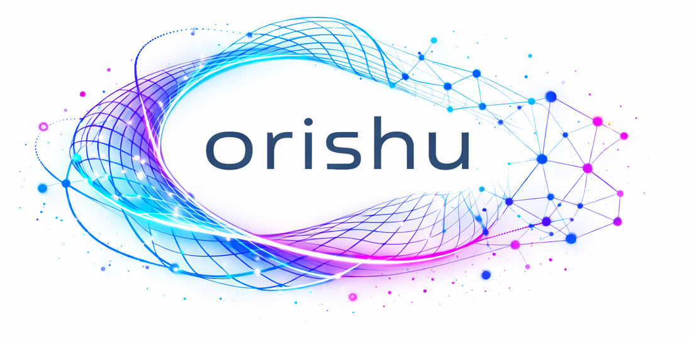
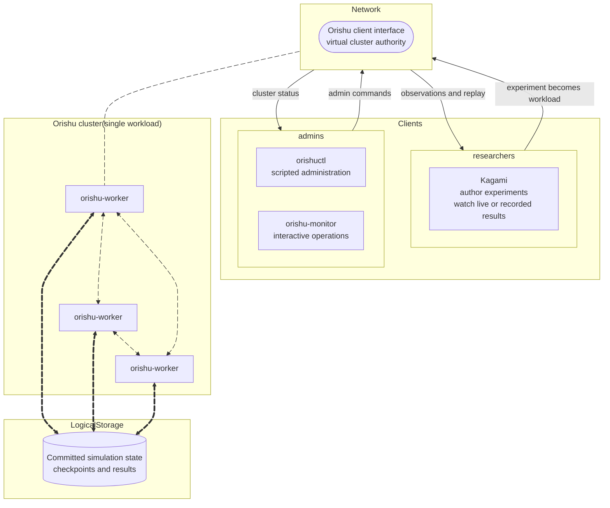

# Orishu Kagami

<p align="center">
    <picture>
        <source width="420" media="(prefers-color-scheme: dark)" srcset="./assets/logo-dark.png">
        
    </picture>
</p>

[](https://crates.io/crates/orishu)
[](https://github.com/abbyssoul/orishu-kagami/actions/workflows/unit-tests.yml)
[](./LICENSE)

<br/>

A distributed simulator: _many nodes co-dreaming a single coherent world._

---

Orishu Kagami is a Rust monorepo for authoring, running, and inspecting
distributed scientific simulations.

- **Orishu** is the simulation engine and decentralized cluster runtime.
- **Kagami** is the native client for authoring simulated environments,
  controlling Orishu workloads, and visualizing live or recorded observations.

The product serves three complementary roles:

- **cluster operators** provision and operate workers with `orishuctl` and
  `orishu-monitor`;
- **researchers** use Kagami to author experiments, submit them, and inspect
  live or recorded runs; and
- **simulation plugin developers** use normal IDEs and build tools to implement
  additional physical models and numerical methods that researchers can
  install and select in Kagami.

Kagami is planned to ship with gravity and electrodynamics plugins. Built-in
and third-party plugins use the same declarative authoring schema and pinned,
sandboxed WebAssembly workload-component contract. Kagami manages and consumes
finished plugins; it is not a source-code editor or compiler. See
[Simulation plugins](docs/simulation-plugins.md).

Researchers author a bounded domain, select field families and one
computational model per family, and compose modeled objects from
plugin-contributed components. Dynamics opts an object into integration;
field-coupling components contribute forces. Particle emitters reuse the same
composition by spawning self-contained authored blueprints. Probes, field
vectors, flow lines, trails, and MCP sensor reads observe runs without entering
or blocking scientific state transitions.

Field CAD was the original proof of concept for the authoring, simulation, and
visualization workflow. It is not a separate product in this repository. Proven
ideas and implementations from Field CAD are being rebuilt behind Orishu's
models and client protocol as Kagami develops.

## Why Orishu Kagami?

Scientific simulations can outgrow one machine in compute time, live-state
memory, durable storage, or the ability to serve large results. Orishu explores
a focused alternative to a general task scheduler: a peer cluster cooperatively
advances one spatially partitioned workload, commits coherent simulation
boundaries, and manages its checkpoints and results. One worker is a cluster of
one, using the same workload and observation model as a multi-worker formation.

Kagami makes that runtime usable as a scientific product. Researchers author an
editable experiment, compile it into an immutable workload, submit it to a
configured cluster, and independently inspect live or recorded observations.
Extension code uses pinned, capability-limited WebAssembly Components, while
the runtime retains authority over time, partitioning, networking, storage, and
commit.

The project prioritizes scientific correctness, explicit provenance, bounded
behavior on hostile inputs, capacity, and operator clarity alongside measured
performance. Its 10,000-worker and near-linear-scaling goals are research
targets, not claims about the current implementation. See
[Why Orishu exists](docs/why-orishu-exists.md) and the
[scaling objectives](docs/orishu-scaling-objectives.md). Every client, peer,
artifact, and extension boundary remains untrusted even after authentication;
see the [security policy](SECURITY.md).



The client interface is logical: any suitable worker may be an entry point, but
authoritative run state comes from the simulation boundaries committed by the
cluster. Kagami never joins peer membership. See the full
[architecture](docs/architecture.md).

## Status

This is an early research project. The Orishu command-line and worker crates are
present, and Kagami has a functional native application shell and GPU scene
renderer. Kagami can select an Orishu endpoint, but remote workload control and
observation streaming are not connected yet.

## Build and run from source

No binary packages, container images, Cargo application crates, or desktop
installers are currently published as supported releases. The
[installation guide](docs/install.md) distinguishes source-checkout workflows
available today from planned release channels.

Install the Rust toolchain through [rustup](https://rustup.rs/). The checked-in
toolchain file selects the supported compiler and installs `rustfmt` and
`clippy`.

On Debian or Ubuntu, Kagami's windowing stack may also require:

```sh
sudo apt-get install libwayland-dev libxkbcommon-dev libx11-dev \
  libxcursor-dev libxrandr-dev libxi-dev
```

Build and verify the complete repository from its root:

```sh
make build
make test
make check
```

### Orishu

Start a local worker:

```sh
make run-worker
```

In another terminal, inspect it with the operator CLI:

```sh
make run-ctl ARGS="--help"
```

The worker defaults to a per-user Unix socket. Pass `--host` or set
`ORISHU_HOST` when using a different endpoint.

`make run-ctl ARGS="cluster info"` now reports the worker's real standalone
formation identity and local membership summary. Authenticated join/catch-up
and lock/unlock/leave now have three-worker CLI evidence; recovery and full
formation conformance remain in progress. Each instance needs its
own private state directory and client socket; see the
[worker README](apps/orishu-worker/README.md#identity-and-local-inspection).

### Kagami

Start the native client:

```sh
make run-kagami
```

Select an Orishu endpoint explicitly with:

```sh
make run-kagami ARGS="--host cluster.example.com:6680"
```

The selected endpoint is visible in the prototype UI. Network connection and
streaming remain implementation work. To exercise only the offscreen renderer,
without opening a window, run `make smoke-kagami`.

## Repository map

```text
apps/       deployable binaries
crates/     shared Rust modules
docs/       project-wide architecture and development documentation
etc/        deployment configuration for Orishu workers
scripts/    repository checks and automation helpers
```

See [why Orishu exists](docs/why-orishu-exists.md), the
[documentation index](docs/README.md), [architecture](docs/architecture.md),
[installation guide](docs/install.md),
[implementation roadmap](docs/roadmap/README.md),
[simulation-plugin model](docs/simulation-plugins.md), and
[contribution guide](CONTRIBUTING.md) before making structural or behavioural
changes.

## Feedback and contributions

Bug reports, design questions, operator feedback, scientific use cases,
documentation fixes, and focused code changes are welcome. Read the
[contribution guide](CONTRIBUTING.md) before proposing substantial behavior or
architecture changes. Report security issues privately as described in
[SECURITY.md](SECURITY.md).

## License

Licensed under the [Apache License 2.0](LICENSE).
