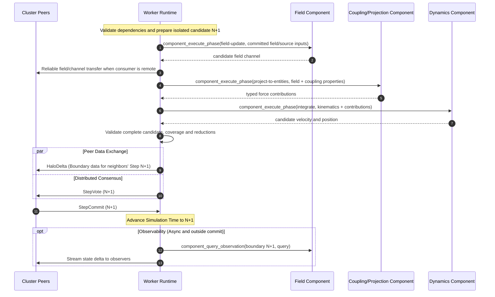

# Workload contract

The workload contract defines the boundary between the worker runtime and
client-supplied executable simulation code. A workload component is an untrusted,
machine-independent guest program, not a trusted native plugin. One workload
may contain a graph of component instances. A product-facing
**simulation plugin** may package component code together with declarative
Kagami authoring schemas, but installing that package does not widen the
component's authority. This document defines the lifecycle the executable
implements and the only services its host provides. For
manifest submission and lifecycle behavior, see the
[workload user stories](./user-stories/orishu/workload.md); for committed-time
and deterministic progression, see the
[spatiotemporal foundation](./spatiotemporal-foundation.md). The governing
sandbox decision is [ADR 0009](./adr/0009-execute-workloads-as-sandboxed-portable-programs.md).
Executable composition and host orchestration are decided by
[ADR 0024](./adr/0024-orishu-orchestrates-a-workload-component-graph.md).
The authoring-facing package is described in
[Simulation plugins](./simulation-plugins.md).

This contract calls each executable artifact a **workload component** and each
configured use of one a **component instance**. Older code and documents use
**workload package** for a single executable artifact. None of these terms
means the portable workload bundle used as a distribution format. The workload
has one root manifest, not necessarily one root executable. ADR 0024 makes
Orishu the host and coordinator of the admitted component-instance graph.

## When this contract applies

This contract becomes relevant only after the worker has completed all
prerequisite steps of workload loading. Before any component code is
instantiated, the worker runtime has already:

1. **Received the workload manifest** — either directly from an operator command or via gossip from a peer that is already running the workload.
2. **Validated requirements and placement** — confirmed that the cluster can
   assign every required component partition to nodes satisfying its engine,
   lifecycle, hardware, limits and placement constraints. A node may be
   eligible for some instances and not others; infeasible complete placement
   rejects the workload before guest initialization.
3. **Fetched the simulation code artifacts** — resolved every component
   descriptor through the selected distribution mechanism and downloaded or
   reused the matching WebAssembly Component bytes.
4. **Verified graph and integrity** — checked every artifact digest/size and
   validated component instances, typed channels, ownership, deterministic
   phase dependencies, placement constraints and aggregate limits.
5. **Fetched initial conditions** — downloaded the initial state artifact from `spec.inputs` (for fresh starts) or obtained a checkpoint payload from peers (for late joins or resumes).

Only after all five steps succeed does the runtime instantiate the assigned
component instances and begin calling the interface described here. Manifest
distribution, graph validation, artifact fetching and integrity verification
remain runtime responsibilities invisible to guests.

## Responsibility split

The worker runtime and component guests have clearly separated
responsibilities. Components implement typed scientific transformations. The
runtime validates and schedules their declared plan, moves state, and commits
the assembled boundary without implementing model-specific equations.

**Worker runtime is responsible for:**

- Parsing and validating the workload manifest.
- Fetching and integrity-checking simulation code and initial condition artifacts.
- Validating and surfacing the workload's temporal-stepping contract, including
  any selected integration scheme and scheme-specific parameters declared in
  the manifest.
- Maintaining fenced ownership maps for component partitions as the cluster
  places and rebalances the admitted graph.
- Placing eligible component partitions and invoking ready step-plan nodes.
- Providing capability-scoped access to declared state/contribution channels
  and enforcing single-writer/reduction rules.
- Exchanging halo (boundary) data with neighboring partitions on other nodes via the cluster protocol.
- Coordinating step barriers (`StepVote` / `StepCommit`) so all partitions advance in lockstep.
- Aggregating and restoring all required component and runtime state at safe
  boundaries.
- Enforcing resource limits (CPU time, memory) and the sandbox execution environment.
- Stamping provenance metadata (worker identity, software version, component
  graph/instance/phase and code digests) onto every committed step result,
  checkpoint, and result artifact
  (see [`StepProvenance`](./protocol-p2p.md#stepprovenance)).
- Streaming state to observers and writing result artifacts to storage.

**Component guests are responsible for:**

- Implementing their declared field update, projection/coupling, integration,
  emission, or other versioned scientific phases.
- Applying the selected integration scheme or other temporal-stepping rules
  declared by the workload manifest. If the workload exposes multiple schemes,
  the choice is fixed by the manifest for that workload epoch rather than
  inferred from a runtime default.
- Initializing owned state from the instance configuration and initial
  conditions supplied by the runtime.
- Using halo data supplied by the runtime to correctly handle partition boundaries — but never requesting or sending it directly.
- Producing serializable versioned state for checkpointing when asked.
- Restoring internal state from a checkpoint payload when asked by the runtime.
- Reporting convergence or diagnostic metrics back to the runtime.

**Component guests must NOT:**

- Access the network. All inter-node communication is handled by the runtime.
- Access the filesystem. Workload code operates only on data provided through the runtime interface.
- Depend on wall-clock time, host random number generators, or any non-deterministic external state.
- Attempt to manage cluster concurrency or placement. Internal guest
  parallelism requires an explicitly admitted lifecycle capability; the runtime
  owns cross-instance/partition scheduling.
- Discover, invoke, or inspect another guest directly. Cross-component exchange
  uses only declared host-mediated channels.
- Assume anything about which partition it is computing or how many partitions exist — the runtime provides this context per invocation.


## Execution model

The simulation advances through discrete committed boundaries. For boundary
`N → N+1`, the runtime executes the manifest's admitted step plan over
component-instance partitions. Each invocation consumes read-only committed
state or earlier candidate channels and produces isolated candidate state or
typed contributions. Orishu performs any required reliable inter-node transfer,
validates the complete candidate and advances time only after the distributed
commit succeeds.

A typical plan may update a field, project that field onto coupled entities as
forces, invoke Dynamics to reduce those contributions and integrate particle
kinematics, and invoke an emitter to propose spawns. This example is not a
universal hard-coded order. Leapfrog, predictor-corrector and other methods may
declare bounded substeps or different dependencies through another admitted
plan/profile.

Conceptually:

```
for each committed boundary N:
    candidate = isolate(committed[N])
    for each ready layer in admitted_step_plan:
        execute independent component invocations concurrently where allowed
        transfer and validate their typed outputs
    validate(candidate)
    atomically commit candidate as boundary N+1
```

The runtime controls this outer loop. Guests never choose their peers,
placement, invocation order or commit point. Independent nodes in the graph may
execute concurrently or on different eligible workers; their declared
dependencies and stable reduction rules make the scientific result independent
of incidental completion order.

### Partition context

Each component invocation operates on an assigned partition. The runtime
provides a _partition context_ describing the relevant domain/entity slice and
the component-instance/phase identity:

- **Partition description** — the model-declared spatial bounds, cell range,
  entity-key range, or other bounded decomposition for this instance. A guest
  cannot infer the cluster's other assignments from it.
- **Global domain parameters** — the full domain size, resolution, and discretization scheme as declared in the manifest. Provided read-only so the code can compute global coordinates or normalized positions if needed.
- **Step number and simulation time** — the current committed-boundary index and the corresponding simulation time value (`step * dt`). These identify the externally committed boundary; the workload may still perform internal substeps or retain bounded integrator history within one boundary-to-boundary advance.
- **Deterministic seed** — a seed derived from `(workloadId, workloadEpoch,
  componentInstanceId, phaseId, partitionId, stepNumber, invocationOrdinal)`.
  A guest must use this exclusively for admitted stochastic behavior.

### Halo data

Many numerical methods require values from neighboring cells to compute
derivatives or fluxes. The runtime collects halo data for each component-owned
field partition and delivers it through that invocation's declared input
channel. Cross-component field-to-particle projections are distinct typed
channels even when their producer and consumer are placed on different nodes.

For a structured-grid model, halo data may be cell layers organized by face
with a fixed admitted depth. Other models declare another bounded halo/channel
schema. The runtime transfers bytes according to that schema; it does not
reinterpret their scientific values.

Guests read halo/input data only during the admitted invocation and never
request it directly. The runtime invokes a plan node only after its required
boundary/dependency inputs are complete and compatible.

### Speculative execution and work stealing

Authoritative component-partition ownership is exclusive and fenced but may
move. Execution may be speculative: multiple eligible workers can compute an
isolated candidate for the same invocation while only one validated result is
accepted.

When a node falls behind, another eligible worker may speculatively execute the
same component-plan invocation. The first valid result for `(workloadEpoch,
step, invocationId, componentInstanceId, partitionId)` wins through normal
vote/commit coordination. Redundant candidates are discarded.

From component code's perspective, this is invisible. The runtime handles all coordination:

- **Starting speculative work:** The runtime may restore or load the required
  component-instance partition state, then execute the same admitted phase
  invocation as its current owner.
- **Cancelling redundant work:** When another result wins, the runtime
  interrupts or discards the redundant invocation and drops any isolated
  candidate/component state. The guest does not distinguish rebalancing,
  graceful stop, or a lost race.
- **No partial results:** A speculative step either completes and wins the race, or is discarded entirely. There is no mechanism for merging partial computation from two workers.

Component code must assume that any phase invocation might be its last for a
partition. It must tolerate `component_drop_partition` between boundaries and
must not accumulate external side effects; meaningful output goes only through
phase results, checkpoints, observations and bounded diagnostics.

This permits eligible workers to absorb work from slower placements while
preserving one authoritative owner/result and the plan's scientific semantics.

### Sandbox environment

Workload code executes as an untrusted WebAssembly Component with no
capabilities beyond computation and the imports explicitly provided by the
`orishu:simulation/component@1` world. A valid signature does not relax this
rule. General WASI interfaces are absent unless a later lifecycle and security
decision explicitly admits them.

The sandbox guarantees are:

- No filesystem access. The workload code cannot read or write files.
- No network access. The workload code cannot open sockets or make HTTP requests.
- No process spawning. The workload code cannot fork or exec.
- No access to wall-clock time or system clocks.
- Memory is bounded by limits accepted from the manifest and independently
  capped by worker policy.
- CPU time or execution fuel per call is bounded; exceeding the limit aborts
  the attempted transition and reports an error.
- Tables, stack, component instances, host-call payloads, diagnostic rates, and
  returned buffers are bounded independently of guest declarations.
- Execution is interruptible through fuel, epoch deadlines, or an equivalent
  runtime mechanism; cancellation does not depend on guest cooperation.
- Traps, invalid outputs, timeouts, and limit violations reject the attempted
  transition. No partial guest state is published as a committed boundary.


## Workload interface
Every component instance implements the same lifecycle shell plus the phase
exports declared by its plugin/model schema and referenced by the admitted step
plan. The runtime also provides a closed set of host functions. Exact WIT
records, discriminants and buffer bindings must be frozen with O-WASM; the
domain interface below is normative about ownership and failure behavior.

### Exported functions (workload -> runtime)

The runtime calls these exports; guests never call them on themselves or on
another guest.

#### `component_init`

```
component_init(instance_context, frozen_params, owned_state_schema) -> status
```

Called for an admitted component instance on a worker. The context names the
workload/epoch, component instance, artifact/model/schema/lifecycle identities,
declared roles and limits. Frozen parameters contain only the instance's
validated configuration. Initialization cannot alter committed state.

Returns success or a structured bounded error. A failure prevents `Ready`.

#### `component_load_partition`

```
component_load_partition(partition_context, owned_initial_state) -> status
```

Loads only state channels the manifest assigns to this instance. A field-model
instance receives its field initial state; Dynamics receives entity kinematic
and integrator state. The runtime rejects extra, missing or cross-instance
state rather than offering ambient access.

For a late join, resume, or reassignment, the runtime restores a checkpoint
instead.

#### `component_restore_checkpoint`

```
component_restore_checkpoint(partition_context, checkpoint_part) -> status
```

Restores the part named by workload, epoch lineage, boundary, component
instance, partition, state schema and component artifact compatibility. The
runtime validates those identities before invocation.

The guest must restore its complete owned state. A run becomes resumable only
when all required component and runtime checkpoint parts form one complete
checkpoint record.

#### `component_execute_phase`

```
component_execute_phase(invocation_context, phase_id, inputs, outputs) -> phase_result
```

Executes one node in the admitted step plan. The instance/schema declares the
phase export and typed channel contract; `phase_id` cannot select an arbitrary
guest function.

**Inputs:**
- `invocation_context` — workload/epoch, boundary, invocation/component/phase,
  partition, simulation time, `dt`, substep/ordinal, deterministic seed and
  accepted execution profile;
- `inputs` — capability-scoped read-only handles for exactly the committed or
  dependency-produced channels named by the plan; and
- `outputs` — isolated write handles for exactly the state/contribution
  channels this node may produce.

**Output:**
- `phase_result` — completion status plus bounded diagnostics and declared
  output coverage. Scientific values reside in the isolated output channels,
  which the runtime validates before making them available to dependent nodes.

Guests must not retain input/output handles after returning. A successful call
does not itself commit anything. Failure discards its candidate outputs and
causes the attempted boundary to fail according to run policy.

**Bounded buffer passing.** Field, particle and contribution state can be large, so the
ABI should avoid redundant copies. This optimization cannot expose arbitrary
host memory or bypass the component boundary. Inputs reside in bounded guest
linear memory or cross as explicit typed resource/buffer handles whose access
the host validates. The guest must not retain borrowed handles after the call;
the runtime validates lengths and returned ranges and copies at an isolation
boundary when required for correctness. A zero-copy implementation is allowed
only when it preserves those ownership and sandbox guarantees. Calls are
bulk/partition oriented; per-particle or per-sample host-call designs do not
satisfy this contract.

Component code does not author provenance or execution identity. After
validating phase outputs and the assembled candidate, the runtime attaches
`StepProvenance` records identifying worker, component instance, phase and code
digest before committing or storing state. This provenance is also bundled
with correctness-bearing halo/component-channel messages as required, allowing
distributed verification of produced state. See
[`StepProvenance`](./protocol-p2p.md#stepprovenance).

#### `component_checkpoint`

```
component_checkpoint(partition_context, boundary) -> checkpoint_part
```

Called at a committed checkpoint boundary. The guest serializes its complete
owned state for this instance/partition into a bounded versioned payload. The
runtime aggregates it with every required component part and runtime-owned
coordination state; no individual part is advertised as a complete checkpoint.

The aggregate must reproduce continued execution under the same workload graph,
step plan, placement-independent execution profile and compatible artifacts.

If the selected stepping scheme carries bounded solver or integrator history across committed boundaries, that history belongs inside the checkpoint payload. Resume is not assumed to be valid across integration-scheme changes unless the workload component explicitly defines such compatibility.

#### `component_query_observation`

```
component_query_observation(partition_context, boundary, query) -> observation_part
```

Extracts a bounded view of this instance's committed state for result artifacts
or observation assembly. It never exposes candidate state and never participates
in the scientific step plan.

The committed logical observation includes complete requested object and field
state. A full-state query supports a simple client; regional, channel and
level-of-detail queries are explicitly identified delivery projections. Query
resource limits and observer backpressure are isolated from step commit: an
overloaded observer may lose a projection or reconnect from a snapshot, but
cannot delay or alter the scientific transition.

Unlike `component_checkpoint`, the output is not required to be restorable; it
is optimized for external consumption.

#### `component_drop_partition`

```
component_drop_partition(partition_context) -> status
```

Called when the runtime relinquishes this instance's partition after
rebalancing, stop, or a lost speculative race. The guest releases resources and
must not infer scientific meaning from the reason. Later work requires another
load or restore.


### Host functions (runtime -> workload)

These are functions provided by the runtime that the workload code may call during execution. They are the only way for workload code to interact with the outside world.

#### Invocation-scoped channel resources

`inputs` and `outputs` in `component_execute_phase` are opaque resources whose
methods are equivalent to:

```
input.describe() -> channel_descriptor
input.read_chunk(offset, max_bytes) -> bytes
output.describe() -> channel_descriptor
output.write_chunk(offset, bytes) -> status
output.finish(coverage, value_count) -> status
```

The host binds each resource to the exact invocation, direction, channel,
schema, dimensions, partition coverage and byte/value limits admitted in the
step plan. Reads and writes outside that grant fail before accessing memory.
Chunks permit streaming and bounded copies; an implementation may provide a
more efficient borrowed-buffer binding under the same semantics. Finishing an
output makes it eligible for validation and dependent phases, not for commit.

#### `host_log`

```
host_log(level, message)
```

Emit a structured log message. The runtime may rate-limit, buffer, or discard log messages to prevent a misbehaving workload from overwhelming the logging subsystem. Log levels follow the standard set: `trace`, `debug`, `info`, `warn`, `error`.

#### `host_read_param`

```
host_read_param(key) -> value
```

Read a parameter from this component instance's frozen, canonical parameter
view by key. Returns the dimensioned canonical value in the versioned workload
ABI representation, or an error if the key does not exist. Although the
source-bearing manifest may define the parameter with variables and an
expression, component code never receives or evaluates that source. Orishu
resolves and validates the complete expression graph before the workload can
enter `Ready`, and the returned value cannot change during the epoch.

#### `host_report_metric`

```
host_report_metric(name, value)
```

Report a named diagnostic or convergence metric for the current step and partition. The runtime aggregates these metrics into `WorkloadStatus.convergenceMetrics` and makes them available to observers and the cluster API. Examples: `"max_velocity"`, `"energy_total"`, `"residual_norm"`.

#### `host_abort`

```
host_abort(reason)
```

Signal an unrecoverable error from a component invocation. The runtime records
the component/phase/partition identity, discards the attempted boundary and
transitions according to run policy. Guests should prefer structured return
errors where possible.


## Data flow

The following diagram illustrates one possible field-to-particle plan for a
single boundary ($N \to N+1$). The admitted workload plan, rather than these
particular phase names, is authoritative.



Each component is a distinct sandbox. Orishu mediates every arrow between them;
co-location may optimize a transfer but does not change channel semantics.


## Lifecycle summary

The following table maps the simulation lifecycle to the workload interface calls:

| Phase | Runtime action | Workload call |
|---|---|---|
| `Loading` (fresh) | Fetch/validate graph and instantiate assigned components | `component_init(...)` per instance |
| `Loading` (fresh) | Load each instance's owned initial state | `component_load_partition(...)` per assigned instance/partition |
| `Loading` (resume/late join) | Restore every required checkpoint part | `component_restore_checkpoint(...)` per assigned instance/partition |
| `Ready` | Wait for cluster coordination or operator command | — |
| `Running` | Execute ready nodes in the admitted plan and validate candidate outputs | `component_execute_phase(...)` per invocation |
| `Running` (stepped) | Same plan; runtime auto-stops after the committed-step limit | `component_execute_phase(...)` per invocation |
| `Running` (checkpoint barrier) | Aggregate all owned state and runtime coordination | `component_checkpoint(...)` per required instance/partition |
| `Running` (observer/result) | Assemble committed observation parts outside commit | `component_query_observation(...)` as required by query |
| `Running` (rebalance) | Release an instance partition | `component_drop_partition(...)` |
| `Running` (rebalance) | Acquire an instance partition | `component_restore_checkpoint(...)` |
| `Stopped` (after step limit) | Auto-checkpoint the complete graph unless disabled | `component_checkpoint(...)` for every required part |
| `Stopped` | Final aggregate checkpoint and result write | checkpoint + observation calls |
| Unload | Release all instance partitions | `component_drop_partition(...)` per instance/partition |


## Lifecycle compatibility

The graph semantics and component ABI are separately versioned. The first
planned graph profile is `orishu.workload-graph/v1`. Each instance declares
engine `wasm-component`, lifecycle `orishu.component/v1`, and implements the
`orishu:simulation/component@1` world. There is no redundant numeric ABI field.

A node rejects a workload during `Loading` if the graph profile or any
component lifecycle is unsupported. Compatibility identifiers are not assumed
forward-compatible.

Backward compatibility is optional: a runtime may support multiple lifecycle identifiers simultaneously, but this is not required.

### Lifecycle stability contract

Within a given lifecycle identifier:

- The function signatures (names, parameter types, return types) are fixed.
- The semantics of each function are fixed — a workload compiled for one lifecycle identifier behaves the same on any runtime that supports that identifier.
- New host functions may only be introduced under a new lifecycle identifier.
- Removing or changing the signature of an existing function requires a new lifecycle identifier.


## Runtime engine

The lifecycle has domain-level semantics, but its first admitted binary binding
is deliberately specific: **WebAssembly Components** whose exports and imports
match `orishu:simulation/component@1`. Component validation, isolated memory, and
the closed import set are part of the security contract, not replaceable
implementation details.

- The manifest declares graph profile `orishu.workload-graph/v1`; every
  instance declares engine `wasm-component` and lifecycle
  `orishu.component/v1`. Each node advertises only profiles, engines and lifecycles it
  actually enforces (see
  [`NodeCapabilities`](./protocol-p2p.md#nodecapabilities)).
- Every node verifies each assigned component content digest and any signature
  required by cluster policy before instantiation. Native JIT/AOT output is a
  local cache and is excluded from workload identity and portable provenance.
- The host satisfies only the imports allowed by the component world. Unknown
  or forbidden imports reject the package before any guest initializer runs.
- The host enforces memory and execution budgets, interruption, bounded host
  calls, and output validation independently of guest code.

Native shared libraries and in-process Python are not supported workload
engines. A future engine requires a separate ADR and threat model demonstrating
equivalent portability, capability isolation, resource enforcement,
cancellation, determinism, and lifecycle behavior. Matching these function
names alone is insufficient.
