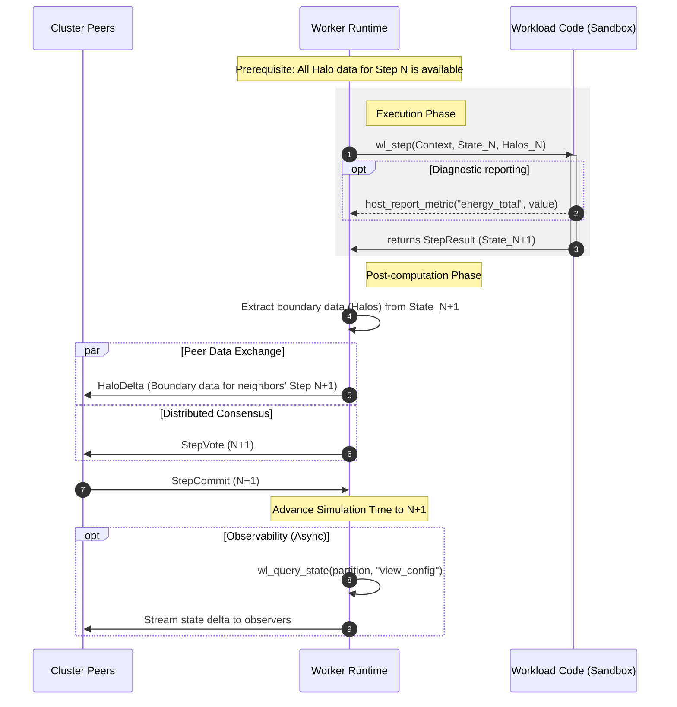

# Workload contract

The workload contract defines the boundary between the worker runtime and
client-supplied executable simulation code. A workload component is an untrusted,
machine-independent guest program, not a trusted native plugin. A product-facing
**simulation plugin** may package this component together with declarative
Kagami authoring schemas, but installing that package does not widen the
component's authority. This document defines the lifecycle the executable
implements and the only services its host provides. For
manifest submission and lifecycle behavior, see the
[workload user stories](./user-stories/orishu/workload.md); for committed-time
and deterministic progression, see the
[spatiotemporal foundation](./spatiotemporal-foundation.md). The governing
sandbox decision is [ADR 0009](./adr/0009-execute-workloads-as-sandboxed-portable-programs.md).
The authoring-facing package is described in
[Simulation plugins](./simulation-plugins.md).

This contract calls that executable the **workload component**. Older code and
documents use **workload package** for the same executable artifact. Neither
term means the portable workload bundle used as one distribution format.

## When this contract applies

This contract becomes relevant only after the worker has completed all prerequisite steps of the workload loading sequence. Before any workload code is instantiated, the worker runtime has already:

1. **Received the workload manifest** — either directly from an operator command or via gossip from a peer that is already running the workload.
2. **Validated requirements** — confirmed that the local node satisfies the manifest's declared requirements: hardware capabilities, runtime lifecycle compatibility, and execution profile. If any requirement cannot be met, the node rejects the workload and transitions to `Error` without ever touching the simulation code.
3. **Fetched the simulation code artifact** — resolved the manifest's pinned
   component descriptor through the selected distribution mechanism and
   downloaded or reused the matching WebAssembly Component bytes.
4. **Verified integrity** — checked the content hash of the downloaded artifact against `metadata.contentHash` declared in the manifest.
5. **Fetched initial conditions** — downloaded the initial state artifact from `spec.inputs` (for fresh starts) or obtained a checkpoint payload from peers (for late joins or resumes).

Only after all five steps succeed does the runtime instantiate the workload code and begin calling the interface described in this document. Everything before this point — manifest distribution, requirement matching, artifact fetching, integrity verification — is the runtime's responsibility and is invisible to the workload code.

## Responsibility split

The worker runtime and the workload code have clearly separated responsibilities. The workload code is the physics — it knows how to advance simulation state from one committed simulation boundary to the next under the workload's declared temporal-stepping contract. The runtime is the infrastructure — it knows where data lives, how to move it between nodes, and when to invoke the physics.

**Worker runtime is responsible for:**

- Parsing and validating the workload manifest.
- Fetching and integrity-checking simulation code and initial condition artifacts.
- Validating and surfacing the workload's temporal-stepping contract, including
  any selected integration scheme and scheme-specific parameters declared in
  the manifest.
- Partitioning the simulation domain and maintaining the partition ownership map as the cluster rebalances.
- Invoking the workload code in a loop, advancing the simulation step by step.
- Exchanging halo (boundary) data with neighboring partitions on other nodes via the cluster protocol.
- Coordinating step barriers (`StepVote` / `StepCommit`) so all partitions advance in lockstep.
- Producing and restoring checkpoints at safe boundaries.
- Enforcing resource limits (CPU time, memory) and the sandbox execution environment.
- Stamping provenance metadata (worker identity, software version, simulation
  code hash) onto every committed step result, checkpoint, and result artifact
  (see [`StepProvenance`](./protocol-p2p.md#stepprovenance)).
- Streaming state to observers and writing result artifacts to storage.

**Workload code is responsible for:**

- Implementing the governing equations that evolve the simulation state from committed boundary `n` to committed boundary `n+1`.
- Applying the selected integration scheme or other temporal-stepping rules
  declared by the workload manifest. If the workload exposes multiple schemes,
  the choice is fixed by the manifest for that workload epoch rather than
  inferred from a runtime default.
- Initializing internal data structures from the manifest parameters and initial conditions provided by the runtime.
- Using halo data supplied by the runtime to correctly handle partition boundaries — but never requesting or sending it directly.
- Producing serializable state for checkpointing when asked by the runtime.
- Restoring internal state from a checkpoint payload when asked by the runtime.
- Reporting convergence or diagnostic metrics back to the runtime.

**Workload code must NOT:**

- Access the network. All inter-node communication is handled by the runtime.
- Access the filesystem. Workload code operates only on data provided through the runtime interface.
- Depend on wall-clock time, host random number generators, or any non-deterministic external state.
- Attempt to manage internal threading or concurrency. The runtime owns the execution strategy and may invoke multiple `wl_step` calls in parallel across different partitions using its own thread pool.
- Assume anything about which partition it is computing or how many partitions exist — the runtime provides this context per invocation.


## Execution model

The simulation advances through discrete committed boundaries. At each boundary, the runtime invokes the workload code for every partition owned by the local worker. The workload code receives the current partition state and halo data from neighboring partitions, computes the next state, and returns it to the runtime. The runtime then handles all coordination — exchanging updated halo regions with peers, confirming step completion via the barrier protocol, and proceeding to the next committed boundary.

This contract does not require every workload to be a naive "one explicit Euler update per visible step" implementation. A workload may perform internal substeps, momentum half-steps, or other bounded scheme-local bookkeeping as part of one `wl_step` call, so long as the externally visible progression between committed boundaries remains deterministic and checkpointable.

From the workload code's perspective, execution is a sequence of calls:

```
for each step n = 0, 1, 2, ...:
    for each partition owned by this worker:
        next_state = workload.step(step_context, current_state, halo_data)
```

The runtime controls the outer loop. The workload code never drives its own iteration — it is called, computes, and returns. This inversion of control allows the runtime to interleave step computation with halo exchange, checkpoint writes, rebalancing, and observer streaming without the workload code being aware of any of it.

### Partition context

Each invocation of the workload code operates on a single partition. The runtime provides a _partition context_ that describes the slice of the simulation domain assigned to this invocation:

- **Partition geometry** — the spatial bounds of this partition within the global domain: origin, extent, and cell count along each axis. The workload code uses this to know which region of space it is computing.
- **Global domain parameters** — the full domain size, resolution, and discretization scheme as declared in the manifest. Provided read-only so the code can compute global coordinates or normalized positions if needed.
- **Step number and simulation time** — the current committed-boundary index and the corresponding simulation time value (`step * dt`). These identify the externally committed boundary; the workload may still perform internal substeps or retain bounded integrator history within one boundary-to-boundary advance.
- **Deterministic seed** — a seed value derived from `(workloadId, workloadEpoch, partitionId, stepNumber)` for any stochastic behavior the workload code requires. The workload must use this seed exclusively — no other source of randomness is permitted.

### Halo data

Many numerical methods require values from neighboring cells to compute derivatives or fluxes at partition boundaries. The runtime is responsible for collecting boundary data from adjacent partitions (which may reside on other nodes) and delivering it to the workload code as _halo data_.

Halo data is a read-only buffer of cell values from the boundary region of each neighboring partition, organized by face (e.g. `+x`, `-x`, `+y`, `-y`, `+z`, `-z` for a 3D structured grid). The depth of the halo — how many layers of neighboring cells are provided — is declared in the manifest's discretization parameters and is fixed for the lifetime of a workload.

The workload code reads halo data during `step` but never writes to it and never requests it. The runtime ensures that by the time `step` is called, all halo data for step `n` is available and consistent.

### Speculative execution and work stealing

Partition assignment is neither exclusive nor permanent. The cluster is designed to tolerate heterogeneous hardware, and nodes with different compute capabilities will complete steps at different rates. To prevent slow nodes from becoming bottlenecks, the runtime allows _speculative execution_: multiple workers may compute the same step for the same partition concurrently.

When a node falls behind — its step completion lags the cluster frontier — other workers are encouraged to _steal_ the lagging partition and race to produce the result. The first worker to submit a valid result for a given `(workloadEpoch, partitionId, step)` wins. Its output is accepted and committed via the normal `StepVote` / `StepCommit` barrier. All other workers computing that same step for that partition are notified that their result is no longer needed and should discard their in-progress computation as soon as possible.

From the workload code's perspective, this is invisible. The runtime handles all coordination:

- **Starting speculative work:** The runtime may call `wl_restore_checkpoint` or `wl_load_partition` to set up a stolen partition, then begin calling `wl_step` on it — exactly the same interface as for any other partition.
- **Cancelling redundant work:** When the runtime learns that another node has already committed the step it is currently computing, it interrupts the in-progress `wl_step` call (or allows it to complete and discards the result) and then calls `wl_drop_partition` to release the partition. The workload code does not need to distinguish between a drop caused by rebalancing, a graceful stop, or a lost race — the cleanup path is the same.
- **No partial results:** A speculative step either completes and wins the race, or is discarded entirely. There is no mechanism for merging partial computation from two workers.

Workload code must therefore be written with the assumption that any `wl_step` invocation might be the last one for that partition — the runtime may drop it at any step boundary. It must also tolerate `wl_drop_partition` being called at any time between steps. The code should not accumulate side effects that depend on running to the end of the simulation; all meaningful output goes through the return value of `wl_step`, `wl_checkpoint`, and `wl_query_state`.

This design means that a heterogeneous cluster self-corrects: fast nodes naturally absorb work from slow nodes, and the simulation progresses at the rate of the fastest available hardware rather than the slowest.

### Sandbox environment

Workload code executes as an untrusted WebAssembly Component with no
capabilities beyond computation and the imports explicitly provided by the
`orishu:workload/lifecycle@1` world. A valid signature does not relax this
rule. General WASI interfaces are absent unless a later lifecycle and security
decision explicitly admits them.

The sandbox guarantees are:

- No filesystem access. The workload code cannot read or write files.
- No network access. The workload code cannot open sockets or make HTTP requests.
- No process spawning. The workload code cannot fork or exec.
- No access to wall-clock time or system clocks.
- Memory is bounded by limits accepted from the manifest and independently
  capped by worker policy.
- CPU time or execution fuel per call is bounded; exceeding the limit aborts
  the attempted transition and reports an error.
- Tables, stack, component instances, host-call payloads, diagnostic rates, and
  returned buffers are bounded independently of guest declarations.
- Execution is interruptible through fuel, epoch deadlines, or an equivalent
  runtime mechanism; cancellation does not depend on guest cooperation.
- Traps, invalid outputs, timeouts, and limit violations reject the attempted
  transition. No partial guest state is published as a committed boundary.


## Workload interface

The workload component must export a set of well-known functions that the runtime calls at defined points in the simulation lifecycle. The runtime also provides a set of _host functions_ that the workload code may call during execution.

### Exported functions (workload -> runtime)

These are the functions the workload component must implement. The runtime calls them — the workload code never calls them on itself.

#### `wl_init`

```
wl_init(manifest_params) -> status
```

Called once when the workload is first loaded onto a worker. Receives the simulation parameters from the manifest (domain type, discretization parameters, time step size, duration, any selected integration scheme and scheme-specific stepping parameters, physics constants, and the full execution profile). The workload code should use this to validate that it can handle the requested simulation and to set up any internal data structures that are independent of a specific partition.

Returns a status indicating success or an error with a human-readable reason. A failure here causes the worker to transition the workload to `Error` state.

#### `wl_load_partition`

```
wl_load_partition(partition_geometry, initial_state) -> status
```

Called once per partition assigned to this worker, after `wl_init` has succeeded. Provides the partition geometry (spatial bounds, cell count) and the initial condition data for this partition's region of the domain. The workload code should populate its internal state arrays from the provided data.

For a fresh start, `initial_state` comes from the initial conditions artifact referenced in the manifest. For a late-joining node or a resumed simulation, the runtime calls `wl_restore_checkpoint` instead.

Returns a status indicating success or an error.

#### `wl_restore_checkpoint`

```
wl_restore_checkpoint(partition_geometry, checkpoint_data) -> status
```

Called instead of `wl_load_partition` when a partition is being restored from a checkpoint (resume after stop, late join, or partition reassignment). The `checkpoint_data` is an opaque payload previously produced by `wl_checkpoint` for the same partition.

The workload code must restore its internal state to exactly the state it was in when the checkpoint was taken. After this call, the runtime will resume stepping from the checkpoint's step number.

Returns a status indicating success or an error.

#### `wl_step`

```
wl_step(step_context, partition_state, halo_data) -> step_result
```

The core computation function. Called once per partition per committed simulation boundary. This is where the governing equations are applied.

**Inputs:**
- `step_context` — step number, simulation time, time step size (`dt`), deterministic seed, and partition geometry. Fixed scheme selection and other workload-wide temporal-stepping parameters come from the manifest data established at `wl_init`.
- `partition_state` — the current state of all cells in this partition. This is the output of the previous `wl_step` call (or the initial/checkpoint state for step 0).
- `halo_data` — read-only boundary data from neighboring partitions, organized by face and halo depth.

**Output:**
- `step_result` — contains the updated partition state after advancing to the next committed simulation boundary, plus optional diagnostic values (e.g. local error norms, maximum velocity, energy totals) that the runtime collects as convergence metrics.

The workload code must not retain references to the input buffers after returning — the runtime may reuse or deallocate them. The returned state becomes the `partition_state` input for the next step.

**Bounded buffer passing.** Partition state and halo data can be large, so the
ABI should avoid redundant copies. This optimization cannot expose arbitrary
host memory or bypass the component boundary. Inputs reside in bounded guest
linear memory or cross as explicit typed resource/buffer handles whose access
the host validates. The guest must not retain borrowed handles after the call;
the runtime validates lengths and returned ranges and copies at an isolation
boundary when required for correctness. A zero-copy implementation is allowed
only when it preserves those ownership and sandbox guarantees.

The workload code does not include any provenance or identity information in
its output. After validating the step result, the runtime attaches a
`StepProvenance` record (worker identity, software version, simulation code
hash) before committing or storing the state. This provenance is also bundled
with `HaloDelta` messages sent to peers, allowing distributed verification of
boundary data integrity. See
[`StepProvenance`](./protocol-p2p.md#stepprovenance).

#### `wl_checkpoint`

```
wl_checkpoint(partition_id) -> checkpoint_data
```

Called by the runtime at checkpoint barriers. The workload code must serialize its complete internal state for the specified partition into an opaque byte buffer. This buffer will be stored by the runtime and may later be passed to `wl_restore_checkpoint` to resume computation.

The checkpoint payload must be self-contained: given the same manifest parameters and partition geometry, `wl_restore_checkpoint` followed by `wl_step` must produce identical results to continuing from the step where the checkpoint was taken.

If the selected stepping scheme carries bounded solver or integrator history across committed boundaries, that history belongs inside the checkpoint payload. Resume is not assumed to be valid across integration-scheme changes unless the workload component explicitly defines such compatibility.

#### `wl_query_state`

```
wl_query_state(partition_id, query) -> state_data
```

Called by the runtime to extract a view of the current simulation state for result artifacts or live streaming to observers. The `query` parameter specifies what data to extract — this may be the full state, a subset of fields, a downsampled view, or a derived quantity depending on what the workload supports.

Unlike `wl_checkpoint`, the output is not required to be restorable — it is optimized for external consumption (visualization, analysis, export).

#### `wl_drop_partition`

```
wl_drop_partition(partition_id) -> status
```

Called when the runtime relinquishes a partition. This happens in several situations: the partition is being rebalanced to another node, the simulation is stopping, or the worker lost a speculative execution race and the partition's step was already committed by another node. The workload code should release any resources associated with this partition and must not assume the reason for the drop. After this call, the runtime will not invoke `wl_step` for this partition unless it is re-loaded via `wl_load_partition` or `wl_restore_checkpoint`.


### Host functions (runtime -> workload)

These are functions provided by the runtime that the workload code may call during execution. They are the only way for workload code to interact with the outside world.

#### `host_log`

```
host_log(level, message)
```

Emit a structured log message. The runtime may rate-limit, buffer, or discard log messages to prevent a misbehaving workload from overwhelming the logging subsystem. Log levels follow the standard set: `trace`, `debug`, `info`, `warn`, `error`.

#### `host_read_param`

```
host_read_param(key) -> value
```

Read a parameter from the workload epoch's frozen, canonical resolved-parameter
set by key. Returns the dimensioned canonical value in the versioned workload
ABI representation, or an error if the key does not exist. Although the
source-bearing manifest may define the parameter with variables and an
expression, workload code never receives or evaluates that source. Orishu
resolves and validates the complete expression graph before the workload can
enter `Ready`, and the returned value cannot change during the epoch.

#### `host_report_metric`

```
host_report_metric(name, value)
```

Report a named diagnostic or convergence metric for the current step and partition. The runtime aggregates these metrics into `WorkloadStatus.convergenceMetrics` and makes them available to observers and the cluster API. Examples: `"max_velocity"`, `"energy_total"`, `"residual_norm"`.

#### `host_abort`

```
host_abort(reason)
```

Signal an unrecoverable error from within the workload code. The runtime will stop execution for this partition, record the reason, and transition the workload toward `Error` state. This is a last resort — workload code should prefer returning error status from the exported functions when possible.


## Data flow

The following diagram illustrates the data flow for a single simulation step ($N \to N+1$), highlighting the interaction between peers, the runtime, and the sandboxed workload code.



The light grey box indicates the sandbox boundary. Inside it, the workload code sees only the data the runtime provides and produces only the data the runtime collects.


## Lifecycle summary

The following table maps the simulation lifecycle to the workload interface calls:

| Phase | Runtime action | Workload call |
|---|---|---|
| `Loading` (fresh) | Fetch and validate artifacts, parse manifest | `wl_init(manifest_params)` |
| `Loading` (fresh) | Extract initial state for each assigned partition | `wl_load_partition(geometry, initial_state)` per partition |
| `Loading` (resume/late join) | Fetch checkpoint data for assigned partitions | `wl_restore_checkpoint(geometry, checkpoint_data)` per partition |
| `Ready` | Wait for cluster coordination or operator command | — |
| `Running` | For each step: deliver halo data, invoke computation | `wl_step(context, state, halos)` per partition per step |
| `Running` (stepped) | Same as above, but runtime counts committed steps and auto-stops after the limit | `wl_step(context, state, halos)` per partition per step |
| `Running` (checkpoint barrier) | Request state serialization | `wl_checkpoint(partition_id)` per partition |
| `Running` (observer/result) | Request state for streaming or result artifact | `wl_query_state(partition_id, query)` per partition |
| `Running` (rebalance) | Release partition to another node | `wl_drop_partition(partition_id)` |
| `Running` (rebalance) | Acquire new partition from checkpoint | `wl_restore_checkpoint(geometry, data)` |
| `Stopped` (after step limit) | Auto-checkpoint at step limit boundary (unless `checkpoint: false`) | `wl_checkpoint(partition_id)` per partition |
| `Stopped` | Final checkpoint and result write | `wl_checkpoint` + `wl_query_state` per partition |
| Unload | Release all partitions | `wl_drop_partition(partition_id)` per partition |


## Lifecycle compatibility

The exported and host functions described above constitute the **workload lifecycle contract**. A workload declares an opaque compatibility identifier in `requirements.runtimeLifecycle`; a node advertises the identifiers it supports for each runtime engine. The first Orishu Kagami profile uses `orishu.workload/v1` with the `wasm-component` engine and `orishu:workload/lifecycle@1` component world. There is no separate numeric ABI-version field.

A node must reject a workload during `Loading` if its lifecycle identifier is unsupported. Compatibility identifiers are not forward-compatible: a runtime that supports `orishu.workload/v1` cannot run an unknown later identifier, because it may depend on different host functions or calling conventions.

Backward compatibility is optional: a runtime may support multiple lifecycle identifiers simultaneously, but this is not required.

### Lifecycle stability contract

Within a given lifecycle identifier:

- The function signatures (names, parameter types, return types) are fixed.
- The semantics of each function are fixed — a workload compiled for one lifecycle identifier behaves the same on any runtime that supports that identifier.
- New host functions may only be introduced under a new lifecycle identifier.
- Removing or changing the signature of an existing function requires a new lifecycle identifier.


## Runtime engine

The lifecycle has domain-level semantics, but its first admitted binary binding
is deliberately specific: a **WebAssembly Component** whose exports and imports
match `orishu:workload/lifecycle@1`. Component validation, isolated memory, and
the closed import set are part of the security contract, not replaceable
implementation details.

- The manifest declares engine `wasm-component` and lifecycle
  `orishu.workload/v1`. Each node advertises only engines and lifecycles it
  actually enforces (see
  [`NodeCapabilities`](./protocol-p2p.md#nodecapabilities)).
- Every node verifies the same component content digest and any signature
  required by cluster policy before instantiation. Native JIT/AOT output is a
  local cache and is excluded from workload identity and portable provenance.
- The host satisfies only the imports allowed by the component world. Unknown
  or forbidden imports reject the package before any guest initializer runs.
- The host enforces memory and execution budgets, interruption, bounded host
  calls, and output validation independently of guest code.

Native shared libraries and in-process Python are not supported workload
engines. A future engine requires a separate ADR and threat model demonstrating
equivalent portability, capability isolation, resource enforcement,
cancellation, determinism, and lifecycle behavior. Matching these function
names alone is insufficient.
