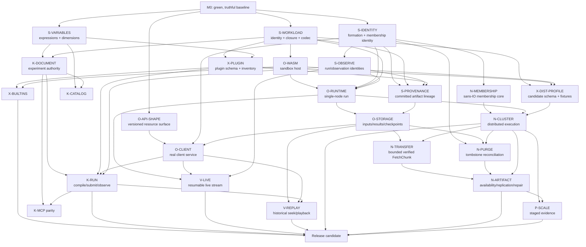

# Implementation roadmap

Status: **living delivery plan**

Last reviewed: **2026-09-05**

This roadmap orders accepted Orishu Kagami design into outcome-based
milestones. It deliberately uses dependency gates rather than calendar dates:
the product is still establishing durable schemas, authority boundaries, and
its first executable vertical slice. A milestone is complete only when its exit
criteria hold through production interfaces.

ADRs remain the authority for architectural decisions. User stories define
user-visible outcomes. Files in `docs/tasks/` define implementation-ready work.
This roadmap explains sequence and concurrency; it does not replace any of
those documents.

Runtime performance, capacity, and resilience claims are governed by the
[Orishu scaling objectives](../orishu-scaling-objectives.md). “Representative
scaling evidence” in this roadmap is a release gate, not a replacement for the
long-term 10,000-worker research target.

ADRs 0013–0015 are accepted constraints on formation identity, artifact purge,
and committed-chunk transport. [ADR 0016](../adr/0016-first-distributed-scientific-profile.md)
is different: Maxwell/Yee remains a proposed conformance profile until its
schema and distributed evidence satisfy the record's validation requirements.
The roadmap therefore treats it as an explicit decision/evidence gate, not as
an already accepted product promise. Maturity tables in the runtime and
storage documents likewise distinguish accepted invariants from open lifecycle
or wire details.

## Product destination

The first complete product should let:

- a cluster operator install self-sufficient Orishu binaries, form and observe
  a cluster, and safely run one workload at a time;
- a researcher use Kagami to author a unit-aware experiment from built-in or
  installed simulation plugins, export or submit an immutable workload, and
  inspect live or persisted observations; and
- a simulation plugin developer build a plugin outside Kagami, then package
  declarative authoring schemas and a sandboxed workload component that follows
  the same contract as built-in gravity and electrodynamics plugins.

The initial collaboration model is file-based experiment sharing plus
independent observation of a shared run. A headless multi-writer document
service is a later product milestone, not part of the first release path.

## Current implementation baseline

As of this review:

- Repository CI, release workflows, a Rust workspace, public documentation,
  and packaging scaffolding exist.
- `crates/orishu` contains substantial imported client and model code, but its
  workload model still mixes mutable locations/status with immutable intent and
  does not implement the accepted content-addressed closure.
- Existing Orishu models partly anticipate ADR 0013—for example, join success
  returns a cluster-assigned `NodeId`—but they lack an explicit formation-ID
  type and still reuse generic optional manifest IDs. The client types and
  future peer messages therefore require contract reconciliation before they
  become stable implementation authority.
- `crates/orishu-variables` now contains the migrated generic namespaced
  expression engine and its tests pass. Dimension/unit semantics, resource
  bounds, experiment integration, and workload integration remain unfinished;
  the variables task is partially implemented, not complete.
- `apps/orishu-ctl` contains a substantial imported command surface.
- `apps/orishu-worker` resolves configuration and listens on TCP or Unix
  sockets, but serves only a placeholder handler; cluster membership,
  admission, execution, storage, and documented APIs are not wired.
- `apps/orishu-monitor` is a placeholder.
- Kagami opens a native window and has an offscreen-capable renderer, but its
  scene tree, open/save, playback, simulation, networking, and run controls are
  prototypes or stubs rather than the accepted experiment authority.
- The tracked workload-format, catalog, MCP, live-observation, and
  historical-playback tasks are specified but not implemented.
- The restored Orishu runtime, storage, provenance, configuration, scaling,
  protocol, and user-story documents now pass link validation, but they do not
  make the placeholder worker a runtime. Several transferred wire and lifecycle
  details remain explicitly open and need bounded tasks before coding.

Do not infer implementation from the amount of protocol or user-story text.
Inspect code and tests before claiming a capability exists.

## Workstreams and ownership

Workstreams are logical ownership areas that can proceed concurrently after
their input contracts are stable.

| Lane | Owns | Primarily shared with |
| --- | --- | --- |
| **S — Shared contracts** | Formation/node/run identity, workload, artifact/provenance, quantity, variable, observation, schema and canonical-codec types | Every other lane; this is the principal integration gate |
| **O — Orishu execution** | Workload admission, WebAssembly host, run loop, checkpoints/results, client service | S, N, V |
| **N — Orishu network/cluster** | Membership, peer transport, partition ownership, halo exchange, step commit, chunk transfer, purge reconciliation, replication and repair | S, O, P |
| **K — Kagami authoring** | Experiment document authority, persistence, compilation, authoring UI, catalog and MCP adapters | S, X, V |
| **X — Scientific extensibility** | Simulation-plugin manifest/inventory, bundled plugins, third-party install/validation | S, K, O |
| **V — Observation and visualization** | Live snapshot/delta streams, historical reads, Kagami run projection/player, renderer adapters | S, O, K |
| **P — Product operations** | CLI/monitor completion, configuration, native/container/cargo distribution, upgrade, security and staged scaling evidence | O, N, K |

Shared does not mean “put everything in one crate.” It means two sides consume
the same versioned contract. Keep implementation in its real owner and expose
only the smallest stable types required across the boundary.

## Work-package registry

The IDs below provide stable coordination names for roadmap discussions. A
linked task is ready to assign according to its status. A row marked **task
specification required** must be promoted into `docs/tasks/` with bounded
slices and acceptance criteria before implementation begins.

| ID | Work package | Lane | State | Depends on |
| --- | --- | --- | --- | --- |
| S-WORKLOAD | [Shared workload format](../tasks/define-and-adopt-shared-workload-format.md) | S | Ready; foundational | M0; S-VARIABLES for expression integration |
| S-VARIABLES | [Shared variables and expressions](../tasks/migrate-and-integrate-variables-subsystem.md) | S | Generic engine present; slices 2–4 remain | M0 |
| S-IDENTITY | Formation, cluster-assigned node, cluster projection, membership-tombstone and run-identity contracts from [ADR 0013](../adr/0013-cluster-formation-and-node-identity.md) | S/N | **Task specification required**; accepted semantics, existing types need reconciliation | M0 |
| S-OBSERVE | Observation/run identity and frame types from [resumable streaming](../tasks/implement-resumable-observation-streaming.md) slices 1–2 | S/V | Ready | S-IDENTITY; coordinate public model edits with S-WORKLOAD |
| S-PROVENANCE | Versioned [committed checkpoint/result provenance](../orishu-provenance.md) and diagnostic-provenance separation | S/O | **Task specification required** | S-IDENTITY; S-WORKLOAD; S-OBSERVE; X-PLUGIN identity |
| K-DOCUMENT | Authoritative experiment model, commands, revisions, persistence and undo | K | **Task specification required** | S-VARIABLES core; schema identities from S-WORKLOAD/X-PLUGIN |
| X-PLUGIN | Simulation-plugin manifest, declarative schemas, inventory and safe management | X/K | **Task specification required** | S-WORKLOAD identity model; S-VARIABLES dimensions |
| X-BUILTINS | Gravity and electrodynamics plugins using the public plugin contract | X | **Task specification required** | X-PLUGIN; O-WASM host contract |
| X-DIST-PROFILE | Concrete first distributed scientific schema, fixtures, limits and validation plan for proposed ADR 0016 or an explicit replacement | X/O/N | **Decision and task specification required**; proposal only until M4 evidence | S-WORKLOAD; X-PLUGIN; O-WASM lifecycle |
| K-CATALOG | [Kagami object catalog](../tasks/implement-kagami-object-catalog.md) | K | Core ready; integration gated | S-VARIABLES; K-DOCUMENT and component schemas for instantiation |
| K-MCP | [Embedded Kagami MCP server](../tasks/kagami-mcp-server.md) | K | Slices 1–7 ready; 8–9 gated | K-DOCUMENT for authoring; O-CLIENT/K-RUN for run parity |
| O-WASM | WebAssembly Component host implementing `orishu.workload/v1` limits and lifecycle | O | **Task specification required** | S-WORKLOAD descriptors; protocol-workload contract |
| O-RUNTIME | Single-node admission, fixed-step run authority and commit loop | O | **Task specification required** | S-IDENTITY; S-WORKLOAD; O-WASM; S-OBSERVE |
| O-STORAGE | Local content-addressed inputs plus checkpoint/result records, [lifecycle states](../storage-spec.md), persistence and coverage index | O | **Task specification required** | S-IDENTITY; S-WORKLOAD artifact identity; S-PROVENANCE; O-RUNTIME boundaries |
| O-API-SHAPE | Resolve imported [client-API compaction findings](../orishu-runtime-future-work.md#client-api-compaction-review) and version the initial resource surface | O/P/S | **Decision/task specification required before O-CLIENT** | S-IDENTITY; runtime data model; storage authority model |
| O-CLIENT | Implement authenticated client API and align `orishuctl` with real server behavior | O/P | **Task specification required** | O-API-SHAPE; O-RUNTIME; O-STORAGE; S-OBSERVE |
| K-RUN | Kagami Orishu adapter, workload submission, run projection and renderer handoff | K/V | **Task specification required** | K-DOCUMENT; S-WORKLOAD; O-CLIENT; S-OBSERVE |
| V-LIVE | [Resumable live observation streaming](../tasks/implement-resumable-observation-streaming.md) slices 3–6 | V/O | Ready after shared frame types | S-OBSERVE; O-RUNTIME; O-CLIENT |
| V-REPLAY | [Time-addressable run playback](../tasks/implement-time-addressable-run-playback.md) | V/O/K | Ready after stored observations | S-OBSERVE; O-STORAGE; O-CLIENT; K-RUN |
| N-MEMBERSHIP | [Sans-IO cluster membership core](../tasks/implement-membership-model.md) | N/S | Ready; identity and wire-contract preflight first | Membership portion of S-IDENTITY; no O-RUNTIME dependency |
| N-CLUSTER | QUIC peer IO, membership adapter, fenced ownership, halo exchange and distributed step commit | N/O | **Task specification required** | N-MEMBERSHIP; proven O-RUNTIME single-node semantics; S-WORKLOAD |
| N-TRANSFER | Bounded QUIC `FetchChunk` framing, offset resume, incremental verification, limits and errors from [ADR 0015](../adr/0015-use-quic-native-artifact-transfer.md) | N/O | **Task specification required**; transport choice accepted | O-STORAGE chunk identity; N-CLUSTER authenticated transport |
| N-PURGE | Persisted purge tombstones and bounded inventory suppression from [ADR 0014](../adr/0014-prevent-purged-artifact-resurrection.md) | N/O | **Task specification required**; in-formation behavior accepted | S-IDENTITY; O-STORAGE; N-CLUSTER reconciliation |
| N-ARTIFACT | [Availability, replication, re-replication, repair](../storage-spec.md) and committed-artifact discovery | N/O | **Task specification required** | O-STORAGE; N-CLUSTER; N-TRANSFER; N-PURGE |
| P-SCALE | Reproducible [1/3/5/12/32-worker](../orishu-scaling-objectives.md#staged-evidence) compute, capacity, storage, retrieval and churn evidence | P/N/O | **Task specification required**; implement harness incrementally | O-RUNTIME; O-STORAGE; N-CLUSTER; N-ARTIFACT |
| P-INSTALL | Native packages, Homebrew, `cargo install`, containers and config-free startup | P | **Task specification required** | Stable binaries and [configuration contract](../orishu-configuration.md); can prototype packaging earlier |
| P-MONITOR | Replace `orishu-monitor` placeholder with read-only operational views | P | **Task specification required** | O-CLIENT; N-CLUSTER status models |

## Dependency graph

The critical path is M0 → identity/workload/observation contracts → sans-IO
membership core and sandboxed single-node execution → real Kagami
submission/observation → selected distributed conformance profile →
distributed execution and artifact safety → staged release evidence. API shape
and committed provenance are early gates, not cleanup after clients or
artifacts ship. Catalog polish, MCP transport, monitor UI, and package
prototypes have useful parallel slices but must not redefine contracts on that
path.

## Milestone 0 — Green and truthful foundation

**Objective:** establish a trustworthy base on which several agents can work
without using stale documentation or placeholder behavior as a contract.

### Focus areas

- Review the selectively transferred Orishu runtime, data-model,
  configuration, storage, provenance, scaling, protocol, ADR, and user-story
  material against current monorepo authority. Preserve its explicit maturity
  labels: accepted invariants and open behavior must not blur together.
- Reconcile ADR 0013 with current Rust models and join messages. Introduce a
  plan for explicit formation identity and confirm that admitted node IDs are
  newly formation-assigned rather than deterministic identities reused across
  formations.
- Resolve the client API compaction findings before O-CLIENT is assigned:
  top-level checkpoint ownership, a noun-shaped compatibility resource, and an
  unambiguous membership-tombstone path. Also specify the distinct authority
  and retention of events, audit records, and logs.
- Scope accepted ADRs 0014–0015 into separate purge and transfer tasks. Preserve
  cross-formation purge retention/compaction and unsettled Merkle/range details
  as open until their owning contracts decide them.
- Define the versioned schema, limits, fixtures, and implementation experiment
  needed to evaluate proposed ADR 0016. It remains proposed until distributed
  numerical, checkpoint, and ownership-transfer evidence exists.
- Reconcile public repository maps (`crates/` versus historical `libs/`) and
  mark every placeholder CLI/server/UI behavior honestly.
- Run the complete existing build/test/lint/docs/smoke baseline and record any
  platform-only manual checks.
- Promote every work package marked “task specification required,” including
  S-IDENTITY, S-PROVENANCE, O-API-SHAPE, X-DIST-PROFILE, N-TRANSFER, N-PURGE,
  and P-SCALE, before assigning its code.
- Give each new task an owning boundary, expected public inputs/outputs,
  hostile-input tests, migration strategy, and explicit non-goals.

### Parallel execution

- Separate agents can draft identity/API, storage/transfer/purge,
  scientific-profile/scaling, Kagami-document, and plugin task specifications
  because those touch different domain areas.
- One integration owner should reconcile terminology and indexes after the
  drafts land; avoid several agents editing `CONTEXT.md` and task indexes at
  the same time.

### Exit criteria

- `make ci` passes on the supported development platform.
- `make docs-check` continues to pass; no restored document links back to an
  absent historical source as implementation authority.
- Root README status and component maps match the actual workspace.
- Every Milestone 1 or 2 work package is linked to an implementation task or
  explicitly removed from scope, and accepted ADRs 0013–0015 have task owners.
- The initial client resource paths are settled before compatibility code is
  written. Proposed ADR 0016 has a bounded validation task but is not described
  as accepted merely to satisfy the roadmap.
- No user story or protocol is cited as proof that behavior is implemented.
- Baseline fixture locations and owners are documented.

## Milestone 1 — Shared semantic spine

**Objective:** freeze the smallest versioned contracts Kagami and Orishu need
to build independently.

### Focus areas

- **S-WORKLOAD slices 1–3:** immutable manifest/artifact types, canonical
  bytes/digests, bounded closure validation, and golden fixtures.
- **S-VARIABLES slices 1–2:** review and land the present generic namespaced
  engine, then add dimension/unit semantics, limits, and source-located errors.
- **S-IDENTITY:** explicit `FormationId`, formation-assigned `NodeId`, cluster
  projection, membership-tombstone, run-identity, and label types with
  JSON/CBOR fixtures. Reconcile the generic optional manifest IDs now used by
  `crates/orishu` rather than treating comments as a sufficient contract.
- **N-MEMBERSHIP preflight:** settle membership-specific identity, probe
  correlation, version merge, removal, anti-entropy, and admission wire
  semantics. The pure core may begin as soon as those consumed contracts land;
  it does not wait for O-RUNTIME.
- **S-OBSERVE slices 1–2:** run identity/reference, observation identity,
  committed boundary, subscription/schema revision, snapshot, delta and
  completeness/validity types.
- **S-PROVENANCE:** immutable committed artifact lineage carrying formation,
  workload/epoch/boundary, component/lifecycle/execution profile,
  model/schema/precision/dimensions/validity/completeness, chunk hashes, and
  profile-required producing-runtime evidence. Keep audit and step diagnostics
  separate.
- **O-API-SHAPE:** settle the imported endpoint compaction findings and version
  the initial client surface before clients or server handlers depend on it.
- **X-DIST-PROFILE:** define a candidate Maxwell/Yee schema, limits, canonical
  state encoding, golden/hostile fixtures, and validation plan for ADR 0016.
  This authorizes an experiment, not premature acceptance of the ADR.
- Specify K-DOCUMENT's core commands/revision/persistence format against those
  types; its in-memory literal-value skeleton may proceed before variable
  integration, but it cannot declare its persisted format complete yet.
- Specify X-PLUGIN's manifest and declarative authoring-schema boundary, with
  one gravity fixture and one deliberately incompatible fixture.

### Parallel execution

- S-VARIABLES dimension work can continue in its own crate independently of
  runtime identity and API-shape work.
- N-MEMBERSHIP can proceed behind reviewed S-IDENTITY fixtures while the
  workload, observation, and authoring lanes continue independently. Its owner
  must not introduce membership-private identity or wire types.
- K-DOCUMENT's command engine can develop against stable placeholder schema
  identifiers while S-WORKLOAD is finalized.
- Plugin schema examples and hostile fixtures can be authored in parallel with
  the workload model, but plugin serialization lands only after digest and
  descriptor types are fixed.
- S-IDENTITY, S-WORKLOAD, S-OBSERVE, and S-PROVENANCE all affect
  `crates/orishu` public models. Assign one shared-contract integrator or
  serialize their public-type commits; do not allow competing representations
  of formation, node, workload epoch, boundary, digest, or artifact lineage.
- API-shape decisions and candidate scientific fixtures are documentation/test
  lanes that can proceed in parallel, but their final schemas consume the
  shared identity and workload contracts.

### Exit criteria

- Identical manifest input produces golden canonical bytes and digests from
  both Kagami-side fixture code and Orishu parsing.
- Cluster and worker labels cannot satisfy an identity field. Standalone
  formation, admission, leave/rejoin, membership tombstone, and run-reference
  fixtures consistently use explicit formation and formation-assigned node
  identities.
- Expressions such as `1e32 kg`, `2.7 g / cm^3`, and `1 / 3 + 0.1` resolve
  deterministically; invalid dimensions, cycles, non-finite values, and work
  limits fail structurally.
- A snapshot/delta fixture cannot be applied across workload, epoch,
  observation, schema, subscription, or baseline identity.
- A plugin fixture names declarative model capabilities and a pinned component
  without native code, paths, mutable tags, or ambient capabilities.
- A committed-provenance fixture contains enough immutable identity to validate
  a checkpoint/result without consulting transient gossip, display labels,
  Kagami installation state, or diagnostic history.
- No O-CLIENT task depends on the three unresolved resource-path findings. ADR
  0016 has a concrete candidate schema and hostile/golden fixtures while its
  acceptance still awaits Milestone 4 evidence.
- Public contract tests are green without starting a GUI, network, or solver.

## Milestone 2 — Authoring and admission foundations

**Objective:** produce a real experiment and independently validate the exact
workload it would submit, before attempting distributed execution.

### Focus areas

- Implement K-DOCUMENT: typed commands, atomic validation, stable identities,
  revisions, save/open, dirty state, local undo/redo, and provenance.
- Complete S-VARIABLES experiment integration and workload-resource validation.
- Implement X-PLUGIN inventory/install/remove/compatibility behavior and expose
  the same public path for bundled and third-party plugins.
- Implement K-CATALOG core/load/authority slices while its instantiation waits
  for K-DOCUMENT and component schemas; then integrate instantiation.
- Implement S-WORKLOAD Kagami compilation and Orishu admission slices. Prove a
  deterministic closure with golden fixtures and a thin in-memory/file
  admission round trip; the researcher-facing portable export workflow remains
  Milestone 6 work.
- Implement O-WASM validation, capability filtering, lifecycle invocation,
  metering, cancellation, and hostile-guest tests without yet requiring a
  cluster.
- Build the candidate X-DIST-PROFILE parser/component fixtures only through the
  public workload and plugin contracts. They remain experimental inputs for
  Milestone 4 validation, not a private electrodynamics runtime path.
- K-MCP slices 1–7 may proceed entirely in parallel because its honest
  `kagami_status` transport does not require authoring or run parity.
- Complete N-MEMBERSHIP's deterministic model/message/update/effect core and
  hostile sequence/property tests. QUIC, codecs, timer wheels, and worker
  integration remain Milestone 4 work.

### Parallel execution

- Kagami document, plugin inventory, catalog core, WebAssembly host, candidate
  distributed-profile fixtures, and MCP lifecycle can be owned by separate
  agents after Milestone 1 fixtures land.
- S-VARIABLES integration touches both K-DOCUMENT and workload admission; its
  owner should publish its API before the two adapters integrate it.
- `Cargo.toml` and `Cargo.lock` are integration choke points. Batch dependency
  changes by work package and merge them before dependent agents rebase.

### Exit criteria

- Kagami creates, edits, saves, reopens, and deterministically recompiles a
  minimal experiment revision through the document authority; the demo scene
  is not treated as domain state.
- Kagami installs and selects the gravity fixture through the public plugin
  contract; removing it preserves the document and reports the capability as
  unavailable.
- A catalog object instantiates as self-contained authored state and survives a
  round trip without the source catalog.
- Kagami deterministically compiles a workload closure fixture containing the
  exact component and initial conditions; Orishu's admission path accepts the
  same bytes and rejects missing, corrupt, oversized, incompatible, or
  forbidden artifacts.
- Admission freezes the exact resolved variables, component/lifecycle,
  model/schema, precision/dimensions, and execution profile later required by
  committed provenance.
- A trapped, timed-out, or capability-violating component cannot commit output.
- MCP can be safely enabled/disabled and answer honest status over its real wire
  protocol, while authoring/run tools remain absent until their gates exist.
- The membership core deterministically handles formation-scoped admission,
  SWIM probes/suspicion, membership gossip, removal fencing, and bounded
  anti-entropy without networking, async-runtime, clock, filesystem, TLS, or
  RNG dependencies.

## Milestone 3 — Single-node end-to-end simulation

**Objective:** run one useful deterministic experiment through the complete
product using a single worker—the degenerate one-node cluster.

### Focus areas

- Implement O-RUNTIME's admitted-workload state machine, fixed-step loop,
  simulation-boundary commit, start/stop/step/reset controls, and provenance.
- Implement O-STORAGE locally: verified content cache, workload pinning,
  checkpoint/result chunks, committed records/provenance, purge-tombstone
  persistence, retention and coverage index. Specify created, visible,
  retrievable, under-replicated, durable, unavailable, and incomplete states
  rather than collapsing them into existence booleans.
- Replace the worker placeholder route with the supported subset of O-CLIENT;
  align `orishuctl` commands with the resolved O-API-SHAPE endpoints and
  structured failures.
- Implement X-BUILTINS gravity first through the public plugin/component
  contract; start electrodynamics only when the same lifecycle is proven.
- Implement K-RUN's connection, compatibility check, exact-revision submission,
  control, observation projection, and renderer handoff.
- Implement a minimal V-LIVE snapshot stream sufficient for the first client;
  full resumption/backpressure hardening remains Milestone 5.

### Parallel execution

- Runtime/sandbox integration, local storage/provenance, client-service
  routing, gravity component, and Kagami adapter can proceed as separate lanes
  against Milestone 1 contracts and shared conformance fixtures.
- The first vertical integration should occur early with a trivial test
  component; do not wait for polished physics or UI before exercising the wire.
- One end-to-end owner controls fixture version changes and merges across the
  worker/client/Kagami seam.

### Exit criteria

- A clean single worker starts with no required config, creates one explicit
  formation and member identity distinct from their labels, and reports real
  status.
- Kagami authors or opens a gravity experiment, compiles an exact revision,
  submits it, starts it, steps it deterministically, and displays committed
  observations through the documented client protocol.
- The same workload can be submitted by supported non-Kagami tooling without a
  second schema or weaker validation path.
- Stop and checkpoint produce complete verified artifacts; reset resumes from
  a compatible checkpoint with a new epoch; a result carries complete
  committed provenance independent of diagnostic logs and transient gossip.
- Storage reports creation incompleteness, current unavailability,
  under-replication, discovery, and satisfied durability distinctly. A local
  purge records deletion intent before removing visibility.
- Repeating the fixed fixture produces the declared deterministic result, with
  analytic/reference and convergence evidence appropriate to the model.
- Worker, CLI, Kagami, and protocol integration tests exercise real serialized
  requests and responses; no success path depends on the placeholder handler.

## Milestone 4 — Distributed Orishu execution

**Objective:** preserve the single-node scientific result while executing it
across a real peer cluster with failure-aware coordination.

### Focus areas

- Implement N-CLUSTER's IO shell around N-MEMBERSHIP: mTLS/QUIC handshake,
  bounded codec, authenticated context, entropy/ID generation, timer wheel,
  persistence/diagnostic adapters, and formation-scoped worker lifecycle.
  Duplicate display names and reused cluster labels must remain safe.
- Integrate the already-tested membership effects and outcomes with real
  admission, gossip, anti-entropy, and multi-process failure detection before
  adding distributed execution coordination.
- Add partition planning, halo exchange, step votes/commit, deterministic
  reduction/ordering, cancellation, and epoch transitions around O-RUNTIME.
- Implement N-TRANSFER as bounded `FetchChunk` exchanges on authenticated,
  formation-scoped QUIC streams. Decide and test block framing, offset-resume
  verification boundaries, Merkle use, exact limits, cancellation, and error
  behavior before treating the protocol prose as executable specification.
- Implement N-PURGE and bounded post-admission inventory reconciliation per ADR
  0014 so offline workers cannot resurrect artifacts purged in the active
  formation. Do not claim durable cross-formation deletion yet.
- Implement N-ARTIFACT: availability, placement, replication,
  re-replication, read repair, late-join catch-up, checkpoint/result
  completeness, and bounded cache/pinning behavior. Keep committed artifact
  transfer separate from live checkpoint/catch-up state transfer.
- Exercise the proposed X-DIST-PROFILE through one/multiple partitions,
  checkpoint/resume, ownership transfer, and rebalancing. ADR 0016 becomes
  accepted only if its concrete Maxwell/Yee profile passes its declared
  tolerance and hostile-input gates; otherwise supersede it explicitly with a
  profile that exercises the same runtime semantics.
- Make any eligible entry node present one coherent O-CLIENT service without
  becoming a separate authority.
- Complete operator CLI coverage needed to form, inspect, lock, diagnose, and
  safely change a cluster. Begin P-MONITOR read-only views after status models
  stabilize.
- Establish reproducible 1/3-worker correctness and performance measurements,
  then a 5-worker correctness/churn stage. The `2 * y < x` three-worker target
  is measured and explained if missed; it is a research target, not a hidden
  release-pass substitution for correctness.

### Parallel execution

- Membership IO integration, partition/step coordination, committed-chunk
  transfer, purge/inventory reconciliation, artifact replication,
  scientific-profile validation, scaling harnesses, and operator tooling are
  distinct agents' lanes once message schemas and state machines have named
  owners.
- Partition commit cannot be declared complete against mock membership alone;
  merge it with real transport before optimizing.
- Artifact replication depends on stable membership, storage chunk identity,
  and N-TRANSFER; purge suppression depends on formation identity and
  post-admission inventory. Availability-index, corrupt-transfer, and stale
  inventory fixtures can be built earlier.

### Exit criteria

- Three workers form one authenticated cluster, agree on formation/workload
  identity and epoch, and execute a partitioned fixture to the same declared
  result as one worker.
- Formation and node identities—not names—scope every post-admission message,
  membership tombstone, ownership transition, and producing-node reference.
  Leaving and joining another formation drops the old assigned node identity.
- No boundary commits until required halos and step decisions are complete and
  valid; loss, duplication, reordering, and stale epochs cannot corrupt state.
- A worker may join late, obtain verified catch-up state, and contribute only
  after reaching a committed boundary.
- A worker failure during execution produces either a safe recovery/rebalance
  or an explicit failed boundary—never a plausible partial result.
- Checkpoint/result chunks remain verifiable and discoverable across permitted
  node loss according to the documented replication policy.
- Interrupted committed-chunk transfer resumes only after the retained prefix
  is verified; malformed blocks, false holder claims, wrong formations,
  offsets, sizes, hashes, and integrity metadata cannot enter storage or repair.
- A purged artifact cannot return when an offline holder rejoins the same
  formation. Operator output describes this exact guarantee and does not imply
  unresolved cross-formation purge retention.
- ADR 0016 is either accepted with golden/hostile, `f64` reference, partition,
  checkpoint/resume, ownership-transfer, and rebalancing evidence, or is
  explicitly superseded by an accepted replacement profile with equivalent
  distributed-runtime coverage.
- The 1/3/5-worker evidence is reproducible and reports scientific equivalence,
  elapsed/useful work, hardware/topology, CPU/memory/network, halo/barrier,
  storage, retrieval, and churn costs. Failure to reach `2 * y < x` is reported
  and diagnosed rather than concealed by changing the fixture.
- Operator tools expose actionable membership, ownership, workload, storage,
  and failure state without requiring direct internal access.

## Milestone 5 — Multi-client live and recorded observation

**Objective:** deliver the accepted file-sharing plus shared-run collaboration
baseline to multiple independent Kagami clients.

### Focus areas

- Complete V-LIVE: acknowledgements/resume cursors, bounded shared baselines,
  snapshot fallback, observer queues, coalescing policy and all transport
  adapters.
- Complete V-REPLAY: run references, persisted coverage index, time-addressed
  reads, exact gaps, finite cursors, local playback and explicit live-head
  handoff.
- Complete Kagami run-player controls and bounded cache: follow, pause, seek,
  rate, reverse navigation, channel/region/LOD subscriptions and stale state.
- Exercise two or more Kagami clients with independent presentation and no
  simulation-data relay through the submitting client.
- Enable K-MCP run reads/controls only after the same K-RUN authority and
  observation projection are used by the UI.

### Parallel execution

- Server baseline retention, historical storage reader, Kagami playback UI,
  and multi-client integration harness can proceed separately against the
  shared observation fixtures.
- Live delivery may coalesce presentation projections; historical delivery is
  exact. Keep separate implementations behind compatible frame semantics
  rather than one ambiguous loss policy.

### Exit criteria

- Two or more clients can follow the same live run with independent
  subscriptions and recover independently after loss or an evicted baseline.
- Other clients can seek and replay persisted ranges at unrelated positions and
  rates while the run remains live or stopped.
- Slow observers never enter the simulation commit path. Bounds shed or reset
  observation work without losing correctness-bearing simulation messages.
- Historical gaps, corruption, incompatible schemas and replacement epochs are
  explicit; no client silently fabricates continuity or follows another run.
- Camera, selection, visibility, interpolation, and playback state remain local
  and cannot be persisted as authoritative scientific output.

## Milestone 6 — Third-party extensibility and complete authoring parity

**Objective:** prove that the public extension and command contracts work for
capabilities not compiled into the product.

### Focus areas

- Complete X-PLUGIN author/manage workflows and documentation for an external
  plugin developer, including validation diagnostics, version compatibility,
  safe install/update/remove, examples and packaging.
- Build one non-bundled example plugin, preferably a small hydrodynamics or
  deliberately simpler conformance model, entirely outside Kagami UI/runtime
  code.
- Complete gravity and electrodynamics bundled plugins through that same path.
- Finish K-CATALOG UI/MCP parity and K-MCP authoring/document/run parity against
  the real authorities.
- Complete experiment File → Export for deterministic portable workload
  bundles. Cluster operators and `orishuctl` do not author or assemble Kagami
  experiments, though operator tooling may submit a prebuilt workload.
- Add compatibility/migration UX for experiments whose required plugin is
  missing or incompatible.

### Parallel execution

- Third-party example plugin, built-in physics validation, catalog UI, MCP
  parity, and export UX can be separate agents' work once schemas and
  authorities are stable.
- Use the external example as a conformance consumer. Do not grant it a private
  API merely to unblock the milestone.

### Exit criteria

- A plugin developer builds and tests a plugin with normal development tools,
  and a researcher installs, inspects, activates, updates, and removes it in
  Kagami with bounded diagnostics.
- An experiment using that plugin saves its exact identities, exports a closed
  workload, and runs on Orishu without access to the originating Kagami
  installation or a hidden artifact repository.
- Removing the installed plugin preserves experiment data and marks capability
  unavailable; it never substitutes physics or mutates an accepted run.
- Built-in and third-party plugins pass the same schemas, digests, sandbox,
  resource limits, workload admission, provenance and conformance tests.
- Every shipped UI authoring/run operation has MCP parity of meaning where ADR
  0006 requires it; presentation-only controls remain excluded.

## Milestone 7 — Installable release candidate

**Objective:** make the validated product operable by its three personas on
supported platforms.

### Focus areas

- Implement P-INSTALL with native packages as the preferred operator path,
  plus supported Homebrew, `cargo install`, release archives and worker
  container images.
- Preserve ADR 0003 self-sufficiency: each binary starts usefully without
  companion files or mandatory setup and handles read-only/no-home environments
  where its selected operation permits it.
- Complete P-MONITOR's useful read-only operational surface or explicitly
  remove it from the release bundle until it is honest.
- Define upgrade, persisted-schema, plugin-schema, protocol and rolling-cluster
  compatibility; test supported migrations and reject unsupported ones.
- Finish security review, fuzzing, resource-limit tests, numerical validation,
  performance/scaling evidence, platform smoke tests and operator/researcher/
  plugin-developer documentation.
- Complete the staged 1/3/5/12/32-worker evidence defined by the Orishu
  scaling objectives, including compute, capacity, artifact, retrieval, and
  churn results. Keep small correctness stages in automated release tests;
  larger 12/32-worker runs may use a reproducible scheduled or laboratory
  environment rather than pretending shared CI has that topology.

### Parallel execution

- Native packaging, container hardening, security fuzzing, numerical benchmark
  evidence, platform UI verification and documentation can run concurrently
  after feature/schema freeze.
- Release engineering owns version/signing metadata and merges packaging
  changes so platform agents do not publish incompatible artifact names.

### Exit criteria

- The release gate passes on Linux, Windows and macOS where applicable; every
  published artifact is reproducible, versioned and accompanied by integrity
  metadata.
- A fresh operator can install and form a cluster using a documented preferred
  native path; `cargo install` and the worker container follow their documented
  config-free defaults.
- A fresh researcher can install Kagami, run a bundled experiment, export it,
  submit it and inspect live and persisted results.
- A plugin developer can follow the public conformance workflow without
  repository-private knowledge or privileged built-in APIs.
- Threat-model, malformed-input, fuzz, deterministic/numerical, recovery,
  backpressure and representative scaling evidence meet the documented bar.
- Published scaling evidence distinguishes measured guarantees from targets,
  includes all five staged worker counts, and reports the three-worker
  `2 * y < x` target honestly whether met or missed. The release does not claim
  the separate 10,000-worker horizon without evidence.
- There are no placeholder commands, undocumented mandatory files, broken
  public links, or claims of behavior that only exists in a design document.

## Post-first-release horizon

The following work is intentionally outside the critical path:

- a stand-alone headless Kagami document authority for live collaborative
  editing, including user identity, capabilities, ordering, conflicts, shared
  undo, assets, persistence and reconnect protocol;
- presenter-follow, shared camera/presence and synchronized playback;
- peer-to-peer/offline multi-writer document merging;
- native or executable Kagami UI/renderer plugins;
- boundary-value-problem execution;
- a general multi-workload scheduler spanning clusters;
- opt-in discovery-assisted admission such as mDNS;
- live changes to worker participation or replication settings;
- durable cross-formation purge retention and provably safe compaction; and
- 10,000-worker and near-linear-scaling validation beyond the staged release
  evidence, while retaining the same runtime and workload model.

Each requires a new decision or an explicitly accepted expansion of an existing
ADR before implementation.

## Parallel-agent execution rules

1. **Claim a work package, not a milestone.** A milestone spans several owners;
   an agent should take one bounded task or slice with named outputs.
2. **Respect gates.** Work may use a checked-in fixture or trait from a
   dependency, but must not create a second “temporary” schema to bypass it.
3. **Publish contracts before adapters.** Land versioned types, golden fixtures,
   error taxonomy and conformance tests before parallel Kagami/Orishu adapters.
4. **Assign integration choke points.** One owner at a time integrates changes
   to root manifests/lockfiles, `crates/orishu` public model exports,
   `CONTEXT.md`, protocol documents, task indexes and shared golden fixtures.
5. **Keep commits slice-shaped.** Separate domain contracts, adapter wiring,
   migrations and presentation changes where possible so dependent agents can
   rebase and verify failures meaningfully.
6. **Test through the production seam.** A direct method test does not satisfy a
   wire, persistence, component-host, or UI-adapter contract.
7. **Report dependencies explicitly.** Handoffs name the exact version/type,
   fixture, command, artifact digest or endpoint another work package may rely
   on, plus remaining incompatibilities.
8. **Do not silently broaden scope.** Record newly discovered cross-cutting work
   as a task or ADR and keep the current slice reviewable.

## Roadmap maintenance

- Update the current baseline when a placeholder becomes real or a public
  interface moves.
- Mark work-package state only when its linked task and production evidence
  agree; “documented” is not “implemented.”
- Review downstream gates whenever a schema, identity, authority or transport
  decision changes.
- Preserve maturity explicitly: an open storage transition, transfer detail,
  or proposed scientific profile does not become accepted because a downstream
  milestone mentions it.
- Add newly accepted work to the registry and dependency graph before assigning
  it across agents.
- Re-evaluate milestone boundaries after each exit gate. Preserve the outcome
  and invariants, but adjust sequencing when implementation evidence exposes a
  better dependency cut.
