# Implementation roadmap

Status: **living delivery plan**

Last reviewed: **2026-09-07**

This roadmap orders accepted Orishu Kagami design into outcome-based
milestones. It deliberately uses dependency gates rather than calendar dates:
the product is still establishing durable schemas, authority boundaries, and
its first executable vertical slice. A milestone is complete only when its exit
criteria hold through production interfaces.

ADRs remain the authority for architectural decisions. User stories define
user-visible outcomes. Files in `docs/tasks/` define implementation-ready work.
This roadmap explains sequence and concurrency; it does not replace any of
those documents.

Runtime performance, capacity, and resilience claims are governed by the
[Orishu scaling objectives](../orishu-scaling-objectives.md). “Representative
scaling evidence” in this roadmap is a release gate, not a replacement for the
long-term 10,000-worker research target.

[ADR 0017](../adr/0017-worker-operational-observability.md) adds operational
metrics, traces and process probes as an accepted, partially delivered
requirement; the current baseline below distinguishes local metrics/probes
from outstanding trace and operational acceptance. Initial worker/formation
observability ships with M4, without waiting for scientific execution;
runtime/storage/observation instrumentation
and operator documentation ship with their owning slices.

ADRs 0013–0015 are accepted constraints on formation identity, artifact purge,
and committed-chunk transport. [ADR 0016](../adr/0016-first-distributed-scientific-profile.md)
is different: Maxwell/Yee remains a proposed conformance profile until its
schema and distributed evidence satisfy the record's validation requirements.
The roadmap therefore treats it as an explicit decision/evidence gate, not as
an already accepted product promise. Maturity tables in the runtime and
storage documents likewise distinguish accepted invariants from open lifecycle
or wire details.

## Product destination

The first complete product should let:

- a cluster operator install self-sufficient Orishu binaries, form and observe
  a cluster, and safely run one workload at a time;
- a researcher use Kagami to author a unit-aware experiment from built-in or
  installed simulation plugins, export or submit an immutable workload, and
  inspect live or persisted observations; and
- a simulation plugin developer build a plugin outside Kagami, then package
  declarative authoring schemas and sandboxed workload component code that follows
  the same contract as built-in gravity and electrodynamics plugins.

The initial collaboration model is file-based experiment sharing plus
independent observation of a shared run. A headless multi-writer document
service is a later product milestone, not part of the first release path.

The [target experiments](../target-experiments.md) describe the broader
scientific research horizon. Shipping a gravity or electrodynamics plugin does
not imply coverage of that entire list: each delivered profile needs explicit
supported phenomena, limits and numerical evidence within the accepted
[initial-value-problem scope](../adr/0002-initial-value-problem-scope.md).

## Documented implementation baseline

The following summarizes the status recorded in the project documentation and
tracked tasks. This summary does not replace each task's scoped verification
and failure ledger; these statements are inputs to planning, not a claim that
the complete runtime acceptance matrix passes.
Recheck the affected task's source and acceptance evidence before assigning work.

- Repository CI, release workflows, a Rust workspace, public documentation,
  and packaging scaffolding exist.
- `crates/orishu` contains substantial imported client and model code, but its
  workload model still mixes mutable locations/status with immutable intent and
  does not implement the accepted content-addressed closure.
- `crates/orishu-identity` now provides the membership portion of ADR 0013:
  explicit formation and cluster-assigned node identities, distinct labels,
  certificate fingerprints, version tuples, incarnations, and membership
  tombstones. `crates/orishu-membership` implements the deterministic sans-IO
  core for admission, join adoption, SWIM, gossip, removal fencing, and bounded
  anti-entropy, including the accepted liveness-gossip merge correction.
- The membership client surface now exposes real formation/node identities
  through the implemented N-FORMATION routes. Imported workload/projection
  shapes, run identity and the remaining cluster projection still need their
  owning S-IDENTITY work.
- `crates/orishu-variables` now contains the migrated generic namespaced
  expression engine and its tests pass. Dimension/unit semantics, resource
  bounds, experiment integration, and workload integration remain unfinished;
  the variables task is partially implemented, not complete.
- `apps/orishu-ctl` contains a substantial imported command surface.
- `apps/orishu-worker` serves the formation/operator subset through Unix or
  configured TLS client listeners and uses authenticated QUIC peer transport.
  N-FORMATION is accepted for source-built Linux; combined M4 remains open.
  A controlled reconciliation fixture
  corrected an insufficient readmission test budget; historical process failures
  remain recorded without a claimed runtime fix. Workload execution/storage APIs
  remain later work.
- `apps/orishu-monitor` implements the P-MONITOR terminal shell: navigation,
  help, honest unavailable states, and terminal-safe shutdown. It has no worker
  API integration and reports no cluster state.
- Feature-gated Prometheus exposition covers the finite formation-metric
  inventory, including retained sessions and catch-up outcomes. Local probes,
  secured-proxy scraping and local OTLP receipt have scoped evidence.
  The [official Collector three-worker walkthrough](../testing-worker-otelcol.md#official-collector-formation-and-log-walkthrough)
  verifies admission trace/log correlation. Selected systemd and rootless Podman
  examples now verify actual log collection and matching Collector receipts.
  The [post-fix recipe refresh](../tasks/cluster-formation-m4-checklist.md#current-build-operator-recipe-verification--2026-09-09)
  also revalidates ingestion, security/pressure, alerts and dashboard queries.
  Reviewed overhead and final M4 acceptance remain open; workload/storage instruments follow
  their owning stages.
- [Kagami](../../apps/kagami/) opens a native window and has an offscreen-capable renderer, but its
  scene tree, open/save, playback, simulation, networking, and run controls are
  prototypes or stubs rather than the accepted experiment authority. The
  authority itself now exists beside it: `crates/kagami-document` holds the
  sans-IO experiment model and `crates/kagami-session` the document server the
  app has not yet been rewired to. Persistence, catalog instantiation and that
  rewiring remain open. A downstream review also identified a bounded
  [K1/K3 follow-up](../tasks/kagami/harden-document-boundaries.md) for unavailable
  schemas, schema refresh, replay binding, revision-qualified save completion,
  and serializable adapter values; it is planned work, not landed behavior.
- The tracked workload-format, catalog, MCP, live-observation, and
  historical-playback tasks are specified but not implemented.
- The restored Orishu runtime, storage, provenance, configuration, scaling,
  protocol, and user-story documents now pass link validation, but they do not
  make the placeholder worker a runtime. Several transferred wire and lifecycle
  details remain explicitly open and need bounded tasks before coding.

Do not infer implementation from the amount of protocol or user-story text.
Inspect code and tests before claiming a capability exists.

## Workstreams and ownership

Workstreams are logical ownership areas that can proceed concurrently after
their input contracts are stable.

| Lane | Owns | Primarily shared with |
| --- | --- | --- |
| **S — Shared contracts** | Formation/node/run identity, workload, artifact/provenance, quantity, variable, observation, schema and canonical-codec types | Every other lane; this is the principal integration gate |
| **O — Orishu execution** | Workload admission, WebAssembly host, run loop, checkpoints/results, client service | S, N, V |
| **N — Orishu network/cluster** | Membership, peer transport, partition ownership, halo exchange, step commit, chunk transfer, purge reconciliation, replication and repair | S, O, P |
| **K — Kagami authoring** | Experiment document authority, persistence, compilation, authoring UI, catalog and MCP adapters | S, X, V |
| **X — Scientific extensibility** | Simulation-plugin manifest/inventory, bundled plugins, third-party install/validation | S, K, O |
| **V — Observation and visualization** | Live snapshot/delta streams, historical reads, Kagami run projection/player, renderer adapters | S, O, K |
| **P — Product operations** | CLI/monitor completion, configuration, native/container/cargo distribution, upgrade, security and staged scaling evidence | O, N, K |

Shared does not mean “put everything in one crate.” It means two sides consume
the same versioned contract. Keep implementation in its real owner and expose
only the smallest stable types required across the boundary.

## Work-package registry

The IDs below provide stable coordination names for roadmap discussions. A
linked task is ready to assign according to its status. A row marked **task
specification required** must be promoted into `docs/tasks/` with bounded
slices and acceptance criteria before implementation begins.

| ID | Work package | Lane | State | Depends on |
| --- | --- | --- | --- | --- |
| S-RESOURCE | [Shared Kubernetes-style resource envelope](../tasks/extract-shared-resource-envelope.md) | S | **Implemented and accepted**; both consumers migrated, wire compatibility pinned, and verification findings resolved | M0 complete; the deferred `metadata.id` vs `metadata.uid` spelling has since been settled in favour of `uid` (see O-API-SHAPE) |
| S-WORKLOAD | [Shared workload format](../tasks/define-and-adopt-shared-workload-format.md) | S | Partial: slices 1–2 and structural slice 3 implemented and accepted in `crates/orishu-workload` — manifest, artifact descriptors, component graph and step plan, deterministic CBOR codec with golden fixtures, streaming closure validator, and bounds applied during authoring deserialization rather than after it. Slice 3's scientific-policy half, Kagami compilation, Orishu admission, distribution seams, and protocol/CLI migration remain | M0; S-RESOURCE for the generic envelope; S-VARIABLES for expression integration |
| S-VARIABLES | [Shared variables and expressions](../tasks/migrate-and-integrate-variables-subsystem.md) | S | Partial: generic and dimensioned evaluation, the declared shared-engine resource bounds, and experiment integration through [K2](../tasks/kagami/integrate-document-variables.md) have landed; slice 4 workload integration remains | S-WORKLOAD for slice 4 |
| S-IDENTITY | Formation, cluster-assigned node, cluster projection, membership-tombstone and run-identity contracts from [ADR 0013](../adr/0013-cluster-formation-and-node-identity.md) | S/N | Membership identity/tombstone types landed in `orishu-identity`; cluster projection and run identity still require specification/reconciliation | M0 |
| S-OBSERVE | Observation/run identity and frame types from [resumable streaming](../tasks/implement-resumable-observation-streaming.md) slices 1–2 | S/V | Ready | S-IDENTITY; coordinate public model edits with S-WORKLOAD |
| S-PROVENANCE | Versioned [committed checkpoint/result provenance](../orishu-provenance.md) and diagnostic-provenance separation | S/O | **Task specification required** | S-IDENTITY; S-WORKLOAD; S-OBSERVE; X-PLUGIN identity |
| K-DOCUMENT | [Kagami capability programme](../tasks/kagami/README.md): authoritative experiment model, commands, revisions, persistence and undo | K | K1, K3, the boundary follow-up, and K4 in full implemented — the `default_view` section landed with K11 slice 2 as format version 2; K2's core graph, K5's command/bridge, and K6's non-gesture app adoption landed; K7 core stories captured; remaining slices are explicitly gated | K2/K5 live symbol sources and K6's real registry wait on X-PLUGIN; K6's gesture bracket is unblocked but unimplemented; K8 needs X-PLUGIN observation identities |
| X-PLUGIN | Simulation-plugin manifest, declarative schemas, inventory and safe management | X/K | **Task specification required** | S-WORKLOAD identity model; S-VARIABLES dimensions |
| X-COMPOSITION | [Composed object execution](../tasks/kagami/define-composed-object-execution.md) | X/S/O | Specified; host-orchestrated component graph accepted | X-PLUGIN; S-WORKLOAD; O-WASM; X-FIELDS |
| X-FIELDS | [Field families and computational-model selection](../tasks/kagami/define-fields-and-model-selection.md) | X/K/S/V | Specified; required before executable model composition | K-DOCUMENT; X-PLUGIN; S-WORKLOAD; S-OBSERVE |
| X-BUILTINS | Gravity and electrodynamics plugins using the public plugin contract | X | **Task specification required** | X-COMPOSITION; O-WASM host contract |
| X-DIST-PROFILE | Concrete first distributed scientific schema, fixtures, limits and validation plan for proposed ADR 0016 or an explicit replacement | X/O/N | **Decision and task specification required**; proposal only until M5 evidence | S-WORKLOAD; X-PLUGIN; O-WASM lifecycle |
| K-CATALOG | [Kagami object catalog](../tasks/implement-kagami-object-catalog.md) and [catalog-variable workload capture](../tasks/capture-catalog-values-in-expressions.md) | K/S | Catalog crate, authority, shared-dimension variable projection, and materialization core implemented and accepted, including the [authority-boundary correction](../tasks/fix-kagami-catalog-authority-boundaries.md); [K5](../tasks/kagami/instantiate-catalog-templates.md)'s document command and bridge have landed; workload/UI/MCP integration remains gated | X-PLUGIN/K2/K5 for remaining live symbol sources; accepted ADR 0018 and S-WORKLOAD for expression capture |
| K-MCP | [Embedded Kagami MCP server](../tasks/kagami-mcp-server.md) | K | Slices 1–7 ready; slice 8's core authoring, expression, lifecycle, and serializable-authority prerequisites have landed, while full parity remains incrementally gated; slice 9 gated | X-PLUGIN/K8/K11 and catalog integration for the remaining slice-8 surface; K-OBSERVATION for sensor reads; O-CLIENT/K-RUN for run parity |
| K-OBSERVATION | [Compile and query observation instruments](../tasks/kagami/compile-and-query-observation-instruments.md) | K/S/V | Specified | K-DOCUMENT K8; S-WORKLOAD; S-OBSERVE; K-RUN/K-PREVIEW |
| K-VIEW | [Kagami viewport workflows](../tasks/kagami/implement-kagami-viewport-workflows.md) and [scene scale](../tasks/kagami/choose-scene-scale.md) | K/V | K11 slices 1–2 implemented: mode machine/gate, orthographic projection, and persisted default view with its own revision. Nothing enters Observation/replay yet. K14 scene scale implemented: `SceneScale`, camera reach declared in render units with the metre-space limit derived from it, `defaultView` section version 2 with the envelope version unchanged, and the view control. Minimal field visualization in M3, richer replay in M6; distant-origin precision remains follow-up work, not a claim of K14 | K-RUN/K-PREVIEW to enter observation; K-RUN/S-OBSERVE/X-FIELDS for follow/fields; V-LIVE for best-effort trails; V-REPLAY/K-OBSERVATION for exact trajectories. Later object/field/trail consumers must convert through `SceneScale` at the render boundary |
| X-EMITTER | [Particle emitters](../tasks/kagami/implement-particle-emitters.md) | X/K/O/N | Specified | K-CATALOG/K5; X-COMPOSITION; S-WORKLOAD; O-RUNTIME; N-CLUSTER for distributed proof |
| O-WASM | [Multi-component WebAssembly host](../tasks/implement-wasm-component-graph-host.md) implementing `orishu.component/v1` and the admitted step plan | O | Specified; gated on shared graph/ABI | S-WORKLOAD graph/descriptors; protocol-workload contract |
| O-RUNTIME | [Single-node admission, fixed-step component-plan authority and commit loop](../tasks/implement-single-node-workload-runtime.md) | O | Specified; lifecycle and integration contracts gated; M2/M3 prerequisite to M5 | S-IDENTITY; S-WORKLOAD; X-COMPOSITION; O-WASM; S-OBSERVE |
| O-STORAGE | Local content-addressed inputs plus checkpoint/result records, [lifecycle states](../storage-spec.md), persistence and coverage index | O | **Task specification required** | S-IDENTITY; S-WORKLOAD artifact identity; S-PROVENANCE; O-RUNTIME boundaries |
| O-API-SHAPE | Resolve imported [client-API compaction findings](../orishu-runtime-future-work.md#client-api-compaction-review) and version the initial resource surface | O/P/S | **Decision/task specification required before O-CLIENT**; the `metadata.uid` spelling is decided and implemented (`ResourceUid`, node resources project their `NodeId`) | S-IDENTITY; runtime data model; storage authority model |
| O-CLIENT | Implement authenticated client API and align `orishuctl` with real server behavior | O/P | **Task specification required** | O-API-SHAPE; O-RUNTIME; O-STORAGE; S-OBSERVE |
| K-RUN | Kagami Orishu adapter, workload submission, run projection and renderer handoff | K/V | **Task specification required** | K-DOCUMENT; S-WORKLOAD; O-CLIENT; S-OBSERVE |
| K-PREVIEW | Local preview of a supported pinned workload through the same sandbox lifecycle and observation semantics | K/O/V | **Task specification required** | K-DOCUMENT; S-WORKLOAD; O-WASM; S-OBSERVE; coordinate projection interface with K-RUN |
| V-LIVE | [Resumable live observation streaming](../tasks/implement-resumable-observation-streaming.md) slices 3–6 | V/O | Ready after shared frame types | S-OBSERVE; O-RUNTIME; O-CLIENT |
| V-REPLAY | [Time-addressable run playback](../tasks/implement-time-addressable-run-playback.md) | V/O/K | Ready after stored observations | S-OBSERVE; O-STORAGE; O-CLIENT; K-RUN |
| N-MEMBERSHIP | [Sans-IO cluster membership core](../tasks/implement-membership-model.md) | N/S | **Accepted**, including the [liveness-gossip merge correction](../tasks/fix-membership-liveness-gossip-merge.md) | Membership portion of S-IDENTITY landed as `crates/orishu-identity`; no O-RUNTIME dependency |
| N-FORMATION | [Operational cluster-formation PoC](../tasks/implement-cluster-formation-poc.md): peer IO shell, membership driver and minimal admin surface | N/P/S | Accepted for source-built Linux, including combined M4 observability/operator handoff at the final checkpoint | N-MEMBERSHIP; membership subset of O-API-SHAPE; companion P-OBSERVABILITY/P-OBS-DOCS for combined M4 acceptance |
| N-NETWORK-PLACEMENT | [Independent peer/client interface placement](../tasks/implement-worker-network-placement.md) | N/P | Slices 1-2 delivered: [ADR 0026](../adr/0026-worker-network-interface-placement.md) and one enforced interface per role on Linux; [namespace wire proof verified](../measurements/worker-network-placement-2026-09-11.md); physical Pi revalidation and multi-interface production slice later | Existing N-FORMATION IO shell; reviewed platform/configuration contract before implementation; not a reopened formation-acceptance gate |
| N-CLUSTER | [Fenced component-partition ownership, halo/channel exchange and distributed step commit](../tasks/implement-distributed-workload-execution.md) over the proven formation transport | N/O | Specified for M5; protocol and scientific-profile decisions gated | N-FORMATION; proven O-RUNTIME single-node semantics; S-WORKLOAD component graph; X-DIST-PROFILE candidate fixtures for scientific acceptance |
| N-TRANSFER | Bounded QUIC `FetchChunk` framing, offset resume, incremental verification, limits and errors from [ADR 0015](../adr/0015-use-quic-native-artifact-transfer.md) | N/O | **Task specification required**; transport choice accepted | O-STORAGE chunk identity; N-FORMATION authenticated transport |
| N-PURGE | Persisted purge tombstones and bounded inventory suppression from [ADR 0014](../adr/0014-prevent-purged-artifact-resurrection.md) | N/O | **Task specification required**; in-formation behavior accepted | S-IDENTITY; O-STORAGE; N-FORMATION reconciliation transport |
| N-ARTIFACT | [Availability, replication, re-replication, repair](../storage-spec.md) and committed-artifact discovery | N/O | **Task specification required** | O-STORAGE; N-CLUSTER; N-TRANSFER; N-PURGE |
| P-SCALE | [Staged compute, capacity, storage, retrieval and churn evidence](../tasks/implement-staged-runtime-scaling-evidence.md) at [1/3/5/12/32 workers](../orishu-scaling-objectives.md#staged-evidence) | P/N/O | Specified; early-M5 executor/lab follow-ups, scientific stages as services land, complete release evidence in M8 | Lab slice consumes N-FORMATION; scientific/storage slices need O-RUNTIME; O-STORAGE; N-CLUSTER; N-ARTIFACT |
| P-DEPLOY | [Qualification of selected worker deployment profiles](../tasks/qualify-worker-deployment-profiles.md) | P/N | Specified; candidate selection in M5, supported-profile qualification in M8; Kubernetes/cloud candidates remain optional and unselected | N-NETWORK-PLACEMENT; P-OBS-DOCS; P-INSTALL artifacts for release qualification |
| P-INSTALL | [Installable archives, native packages, Cargo applications, containers, Kagami installers, and first-run journeys](../tasks/publish-installable-artifacts.md) | P | In progress: candidate archives, Debian builds, Cargo-path installs, checksums/provenance, and Homebrew handoff; supported publication gated by M8 | Stable binaries and [configuration contract](../orishu-configuration.md); can prototype packaging earlier |
| P-OBSERVABILITY | [Feature-gated worker Prometheus metrics, process probes and sampled OTLP traces](../tasks/implement-worker-observability.md) | P/O/N | Formation scope accepted for M4, with measured limitations retained; later workload instruments and release qualification remain planned | Worker startup for probes/metrics; N-FORMATION for peer instrumentation; later O-RUNTIME/O-STORAGE, N-CLUSTER/N-ARTIFACT and V-LIVE/V-REPLAY |
| P-OBS-DOCS | [Operator observability stories, manuals, scrape/probe/collector examples, dashboards and runbooks](../tasks/document-worker-observability.md) | P | Formation recipes and selected deployment collection styles accepted for M4; later release/workload handoff remains planned | P-OBSERVABILITY consumed contracts; P-INSTALL release feature matrix |
| P-MONITOR | [`orishu-monitor` admin TUI shell](../tasks/implement-orishu-monitor-admin-tui.md), followed by [operator API integration and parity](../tasks/integrate-orishu-monitor-operator-api.md); raw formation-admission secrets remain CLI-only | P | Shell task implemented; integration task recorded in backlog | No API gate for the shell; N-FORMATION membership projection for first live views; O-CLIENT and owning mutation contracts for later parity |

## Dependency graph

This graph shows the main integration gates. Edges consume the required
contract or slice, not necessarily completion of the whole upstream package.
For example, N-FORMATION needs only membership identity and membership API
decisions; S-VARIABLES core precedes K-DOCUMENT, while its document integration
follows it. The registry and linked task specify the finer dependencies.

```mermaid
flowchart TD
    M0["M0: green, truthful baseline"]

    SW["S-WORKLOAD<br/>identity + closure + codec"]
    SV["S-VARIABLES<br/>expressions + dimensions"]
    SI["S-IDENTITY<br/>formation + membership identity"]
    SO["S-OBSERVE<br/>run/observation identities"]
    SP["S-PROVENANCE<br/>committed artifact lineage"]
    KD["K-DOCUMENT<br/>experiment authority"]
    XP["X-PLUGIN<br/>plugin schema + inventory"]
    XC["X-COMPOSITION<br/>component execution"]
    XF["X-FIELDS<br/>families + model selection"]
    DP["X-DIST-PROFILE<br/>candidate schema + fixtures"]

    OW["O-WASM<br/>sandbox host"]
    OR["O-RUNTIME<br/>single-node run"]
    OS["O-STORAGE<br/>inputs/results/checkpoints"]
    OA["O-API-SHAPE<br/>versioned resource surface"]
    OC["O-CLIENT<br/>real client service"]

    KR["K-RUN<br/>compile/submit/observe"]
    KP["K-PREVIEW<br/>sandboxed local run"]
    VL["V-LIVE<br/>resumable live stream"]
    VR["V-REPLAY<br/>historical seek/playback"]
    KC["K-CATALOG"]
    KM["K-MCP parity"]
    KO["K-OBSERVATION<br/>probe compile/query"]
    KV["K-VIEW<br/>modes + visualization"]
    XE["X-EMITTER<br/>spawn blueprints"]
    XB["X-BUILTINS"]

    NM["N-MEMBERSHIP<br/>sans-IO membership core"]
    NF["N-FORMATION<br/>real peer/admin PoC"]
    NC["N-CLUSTER<br/>distributed execution"]
    NT["N-TRANSFER<br/>bounded verified FetchChunk"]
    NP["N-PURGE<br/>tombstone reconciliation"]
    NA["N-ARTIFACT<br/>availability/replication/repair"]
    PS["P-SCALE<br/>staged evidence"]
    PO["P-OBSERVABILITY<br/>metrics + probes + traces"]
    PD["P-OBS-DOCS<br/>operator monitoring workflows"]
    M7["M7: external plugin/export<br/>and authoring parity"]
    PI["P-INSTALL<br/>distribution + compatibility"]
    PR["Release candidate"]

    M0 --> SW
    M0 --> SV
    M0 --> SI
    M0 --> OA
    M0 -->|worker contract| PO
    NF -->|formation instruments| PO
    OR -->|runtime instruments| PO
    NA -->|artifact instruments| PO
    VL -->|observer instruments| PO
    PO --> PD
    PO --> PS
    PD --> PR
    SI --> SO
    SV -->|dimensions + document graph| KD
    SW --> XP
    SV --> XP
    XP --> XC
    XP --> XF
    KD --> XF
    SW --> XF
    SO --> XF
    XF --> XC
    SW --> XC
    OW --> XC
    XP -->|schema inventory + availability| KD
    SI --> SP
    SW --> SP
    SO --> SP
    XP --> SP
    SW --> OW
    OW --> OR
    XC --> OR
    SI --> OR
    SW --> OR
    SO --> OR
    OR --> OS
    SP --> OS
    OA --> OC
    SI --> OC
    OS --> OC
    KD --> KR
    XP --> KR
    OC --> KR
    SO --> KR
    KD --> KP
    SW --> KP
    OW --> KP
    SO --> KP
    OR --> VL
    OC --> VL
    SO --> VL
    OS --> VR
    OC --> VR
    KR --> VR
    SV --> KC
    KD --> KC
    KD --> KM
    KR --> KM
    KO --> KM
    KD --> KO
    SO --> KO
    KR --> KO
    KD --> KV
    KR --> KV
    SO --> KV
    XF --> KV
    KC --> XE
    XC --> XE
    OR --> XE
    NC -->|distributed ownership proof| XE
    XP --> XB
    OW --> XB
    SW --> DP
    XP --> DP
    OW --> DP
    SI -->|membership subset| NM
    NM --> NF
    OA -->|membership subset| NF
    NF --> NC
    OR --> NC
    DP --> NC
    OS --> NT
    NF --> NT
    SI --> NP
    OS --> NP
    NF --> NP
    NT --> NA
    NP --> NA
    NC --> NA
    NC --> PS
    NA --> PS
    XB --> PR
    KO --> PR
    KV --> PR
    XF --> PR
    XE --> PR
    KR --> PR
    VL --> PR
    VR --> PR
    NC --> PR
    NA --> PR
    PS --> PR
    KP --> PR
    XP --> M7
    XB --> M7
    KC --> M7
    KM --> M7
    KR --> M7
    M7 --> PR
    PI --> PR
```

Milestone numbers identify delivery outcomes, not a mandatory serial schedule.
Two paths converge at distributed execution:

- Membership identity → membership correction and acceptance → operational
  cluster formation (M4). This path can proceed before M1–M3 finish and has no
  Kagami, workload, storage, or physics dependency.
- Workload/observation contracts → sandboxed single-node execution and storage
  (M3), with candidate scientific-profile fixtures → distributed execution
  (M5), joined by the proven M4 transport.

Kagami authoring/submission demonstrates the M3 product outcome but does not
gate the peer adapter. Multi-client observation (M6) can start against the
single-node service and storage; distributed verification follows M5. Plugin,
catalog, export and MCP work converges at M7. M8 requires all these outcomes
plus operations, compatibility and staged scaling evidence.

API shape and committed provenance are early gates for their consumers. Each
lane settles only the contracts its next slice consumes; unrelated decisions
must not become a global prerequisite.

## Milestone 0 — Green and truthful foundation

**Objective:** establish a trustworthy base on which several agents can work
without using stale documentation or placeholder behavior as a contract.

### Focus areas

- Review the selectively transferred Orishu runtime, data-model,
  configuration, storage, provenance, scaling, protocol, ADR, and user-story
  material against current monorepo authority. Preserve its explicit maturity
  labels: accepted invariants and open behavior must not blur together.
- Reconcile ADR 0013 with current Rust models and join messages. Introduce a
  plan for explicit formation identity and confirm that admitted node IDs are
  newly formation-assigned rather than deterministic identities reused across
  formations.
- Resolve the client API compaction findings before O-CLIENT is assigned:
  top-level checkpoint ownership, a noun-shaped compatibility resource, and an
  unambiguous membership-tombstone path. Also specify the distinct authority
  and retention of events, audit records, and logs.
- Scope accepted ADRs 0014–0015 into separate purge and transfer tasks. Preserve
  cross-formation purge retention/compaction and unsettled Merkle/range details
  as open until their owning contracts decide them.
- Define the versioned schema, limits, fixtures, and implementation experiment
  needed to evaluate proposed ADR 0016. It remains proposed until distributed
  numerical, checkpoint, and ownership-transfer evidence exists.
- Reconcile public repository maps (`crates/` versus historical `libs/`) and
  mark every placeholder CLI/server/UI behavior honestly.
- Run the complete existing build/test/lint/docs/smoke baseline and record any
  platform-only manual checks.
- Promote each work package marked “task specification required” before
  assigning its code. Specify the next bounded slices first; later packages
  may remain registry entries until their input contracts are sufficiently
  stable. M0 does not require the entire roadmap to be implementation-ready.
- Give each new task an owning boundary, expected public inputs/outputs,
  hostile-input tests, migration strategy, and explicit non-goals.

### Parallel execution

- Separate agents can draft identity/API, storage/transfer/purge,
  scientific-profile/scaling, Kagami-document, and plugin task specifications
  because those touch different domain areas.
- One integration owner should reconcile terminology and indexes after the
  drafts land; avoid several agents editing `CONTEXT.md` and task indexes at
  the same time.

### Exit criteria

- `make ci` passes on the supported development platform.
- `make docs-check` continues to pass; no restored document links back to an
  absent historical source as implementation authority.
- Root README status and component maps match the actual workspace.
- Every slice selected to start has a linked task, an owning boundary, stable
  consumed contracts and acceptance criteria. Deferred specifications remain
  visible in the registry, and accepted ADRs 0013–0015 have work-package owners.
- Client resource paths are settled before their handlers or compatibility
  commitments land. N-FORMATION settles its membership subset independently.
  Proposed ADR 0016 requires a bounded validation task before its experiment
  begins; accepting it is not an M0 gate.
- No user story or protocol is cited as proof that behavior is implemented.
- Baseline fixture locations and owners are documented.

## Milestone 1 — Shared semantic spine

**Objective:** freeze the smallest versioned contracts Kagami and Orishu need
to build independently.

### Focus areas

- **S-WORKLOAD slices 1–2 and the structural portion of slice 3** —
  **implemented and accepted:** immutable manifest/artifact types, canonical
  bytes/digests, bounded closure integrity checks, golden fixtures, and an
  authoring boundary whose collection bounds apply while a document is read
  rather than to the collection it produced. Full expression, profile and
  component-policy validation completes in M2 with the relevant validators; a
  structural closure check alone cannot authorize execution.
- **S-VARIABLES:** the generic namespaced engine, its dimension/unit semantics,
  and its declared source/depth/node/variable/dependency/evaluation bounds have
  landed at the shared public engine boundary, with caller-supplied limits and
  structured refusals. Integrate workload resources after S-WORKLOAD fixes
  their expression-capable fields.
- **S-IDENTITY:** explicit `FormationId`, formation-assigned `NodeId`, cluster
  projection, membership-tombstone, run-identity, and label types with
  JSON/CBOR fixtures. Reconcile the generic optional manifest IDs now used by
  `crates/orishu` rather than treating comments as a sufficient contract.
- **N-MEMBERSHIP preflight:** settle membership-specific identity, probe
  correlation, version merge, removal, anti-entropy, and admission wire
  semantics. The pure core may begin as soon as those consumed contracts land;
  it does not wait for O-RUNTIME.
- **S-OBSERVE slices 1–2:** run identity/reference, observation identity,
  committed boundary, subscription/schema revision, snapshot, delta and
  completeness/validity types.
- **S-PROVENANCE:** immutable committed artifact lineage carrying formation,
  workload/epoch/boundary, component/lifecycle/execution profile,
  model/schema/precision/dimensions/validity/completeness, chunk hashes, and
  profile-required producing-runtime evidence. Keep audit and step diagnostics
  separate.
- **O-API-SHAPE:** settle the imported endpoint compaction findings and version
  the initial client surface before clients or server handlers depend on it.
- **X-DIST-PROFILE:** define a candidate Maxwell/Yee schema, limits, canonical
  state encoding, golden/hostile fixtures, and validation plan for ADR 0016.
  This authorizes an experiment, not premature acceptance of the ADR.
- K-DOCUMENT's K1 model, K3 authority, landed-boundary follow-up, K2 core
  variable graph, K4 persistence including the default-view section, K5
  instantiation bridge, K6 non-gesture app adoption, and K11's workspace modes
  and projection have landed. Remaining slices consume X-PLUGIN's
  symbol/schema inventory and a run authority; do not describe those gated
  slices as implemented.
- Specify X-PLUGIN's manifest and declarative authoring-schema boundary, with
  one gravity fixture and one deliberately incompatible fixture.

### Parallel execution

- S-VARIABLES shared-engine limit hardening is complete in its own crate;
  its remaining workload integration waits on S-WORKLOAD.
- K-DOCUMENT's implemented slices may be consumed now. Remaining plugin-symbol
  work waits on its explicit gates. K14 scene scale has landed on the K11
  mode/default-view foundation; K6 gestures are ready and should build on
  `AuthoringView` as the validated unit K14 made it. K7 remains an independent
  documentation task.
- N-MEMBERSHIP can proceed behind reviewed S-IDENTITY fixtures while the
  workload, observation, and authoring lanes continue independently. Its owner
  must not introduce membership-private identity or wire types.
- K-DOCUMENT's command engine can develop against stable placeholder schema
  identifiers while S-WORKLOAD is finalized.
- Plugin schema examples and hostile fixtures can be authored in parallel with
  the workload model, but plugin serialization lands only after digest and
  descriptor types are fixed.
- S-IDENTITY, S-WORKLOAD, S-OBSERVE, and S-PROVENANCE all affect
  `crates/orishu` public models. Assign one shared-contract integrator or
  serialize their public-type commits; do not allow competing representations
  of formation, node, workload epoch, boundary, digest, or artifact lineage.
- API-shape decisions and candidate scientific fixtures are documentation/test
  lanes that can proceed in parallel, but their final schemas consume the
  shared identity and workload contracts.

### Exit criteria

- Identical manifest input produces golden canonical bytes and digests from
  both Kagami-side fixture code and Orishu parsing.
- Cluster and worker labels cannot satisfy an identity field. Standalone
  formation, admission, leave/rejoin, membership tombstone, and run-reference
  fixtures consistently use explicit formation and formation-assigned node
  identities.
- Expressions such as `1e32 kg`, `2.7 g / cm^3`, and `1 / 3 + 0.1` resolve
  deterministically; invalid dimensions, cycles, non-finite values, and work
  limits fail structurally.
- A snapshot/delta fixture cannot be applied across workload, epoch,
  observation, schema, subscription, or baseline identity.
- A plugin fixture names declarative model capabilities and a pinned component
  without native code, paths, mutable tags, or ambient capabilities.
- A committed-provenance fixture contains enough immutable identity to validate
  a checkpoint/result without consulting transient gossip, display labels,
  Kagami installation state, or diagnostic history.
- No O-CLIENT task depends on the three unresolved resource-path findings. ADR
  0016 has a concrete candidate schema and hostile/golden fixtures while its
  acceptance still awaits Milestone 5 evidence.
- Public contract tests are green without starting a GUI, network, or solver.

## Milestone 2 — Authoring and admission foundations

**Objective:** produce a real experiment and independently validate the exact
workload it would submit, before attempting distributed execution.

### Focus areas

- Implement K-DOCUMENT: typed commands, atomic validation, stable identities,
  revisions, save/open, dirty state, local undo/redo, and provenance.
- K-DOCUMENT's landed-boundary follow-up is closed: unavailable component
  intent is preserved, schema context refreshes without an authored revision,
  replay is bound to actor and payload, save completion is qualified by the
  revision actually written, and adapters have an explicit serializable
  boundary.
- Complete S-VARIABLES workload-resource validation; its experiment
  integration and shared-engine limit hardening have landed.
- Implement X-PLUGIN inventory/install/remove/compatibility behavior and expose
  the same public path for bundled and third-party plugins.
- Stabilize X-COMPOSITION's schema/workload/lifecycle contract: intrinsic pose
  and velocity, Dynamics-presence integration, and typed field-force
  contributions through ADR 0024's host-orchestrated component graph.
- Define X-FIELDS: a bounded domain, stable field-family/model identities,
  exactly one model per family, stable coupling-property identities, and
  complete logical field observations with projected delivery.
- Model K8 observation instruments and compile their stable channel identities
  into bounded workload requests; runtime readings and MCP queries land with
  K-OBSERVATION in the execution/observation milestones.
- Preserve K4/K11's landed, separately versioned default view.
  [K14 scene scale](../tasks/kagami/choose-scene-scale.md) is **implemented**:
  bounded metres per viewport unit, scale-relative camera reach, checked
  geometry/camera mapping, and an explicit view control. Only the view-section
  version advanced, with migration from its version 1. Authoring view changes
  dirty the file without entering experiment revisions, undo or workloads;
  playback changes remain ephemeral. This is presentation scale, not domain
  size or solver resolution.
- Materialize particle-emitter catalog selections into self-contained authored
  spawn blueprints, then revalidate/copy them during compilation without a live
  catalog dependency. Runtime emission remains gated on O-RUNTIME, with distributed
  ownership evidence in Milestone 5.
- Preserve the landed K5 command and bridge that commit materialized candidates
  from `kagami-catalog` through K-DOCUMENT. Complete its live plugin/catalog
  symbol-source half after those schemas are ready.
- Implement S-WORKLOAD Kagami compilation and Orishu admission slices. Prove a
  deterministic closure with golden fixtures and a thin in-memory/file
  admission round trip; the researcher-facing portable export workflow remains
  Milestone 7 work.
- Implement O-WASM validation, capability filtering, multi-instance phase
  coordination, typed bulk channels, metering, cancellation, atomic failure,
  checkpoint-part handling, and hostile-guest tests without yet requiring a
  cluster.
- Build the candidate X-DIST-PROFILE parser/component fixtures only through the
  public workload and plugin contracts. They remain experimental inputs for
  Milestone 5 validation, not a private electrodynamics runtime path.
- K-MCP slices 1–7 may proceed entirely in parallel because its honest
  `kagami_status` transport does not require authoring or run parity.
- N-MEMBERSHIP is accepted, including its
  [liveness-gossip merge correction](../tasks/fix-membership-liveness-gossip-merge.md);
  its deterministic model/message/update/effect core and hostile
  sequence/property tests provide the base for N-FORMATION. QUIC, codecs,
  timer wheels, worker integration, and the minimal operator surface remain
  Milestone 4 work.

### Parallel execution

- Kagami document, plugin inventory, catalog core, WebAssembly host, candidate
  distributed-profile fixtures, and MCP lifecycle can be owned by separate
  agents after Milestone 1 fixtures land.
- S-VARIABLES integration touches both K-DOCUMENT and workload admission; its
  owner should publish its API before the two adapters integrate it.
- Within K-DOCUMENT, K4 persistence, K5's catalog command/bridge, K6's
  non-gesture app adoption, and K11's mode/default-view slices have landed.
  Remaining symbol-source work follows X-PLUGIN; the gesture bracket is
  unblocked and can proceed now that the viewport publishes drags. K7's
  remaining stories can run throughout; K8's probe story is satisfied and now
  waits on the X-PLUGIN observation-channel identity.
- X-COMPOSITION can implement against X-PLUGIN/S-WORKLOAD/O-WASM fixtures while
  K4–K8 proceed. Emitter authoring and blueprint compilation follow K5 and that
  contract without blocking ordinary-object persistence.
- K14 ran independently of worker formation, workload admission and run
  transport, and proved itself on synthetic geometry through the real
  conversion/projection boundary — which is still the only proof available
  until object rendering lands. Every later object, field and trail consumer
  must convert through `SceneScale` at that boundary rather than casting metres
  to `f32`. A general quantity formatter was not a prerequisite and remains
  S-VARIABLES' to place.
- `Cargo.toml` and `Cargo.lock` are integration choke points. Batch dependency
  changes by work package and merge them before dependent agents rebase.

### Exit criteria

- Kagami creates, edits, saves, reopens, and deterministically recompiles a
  minimal experiment revision through the document authority; the demo scene
  is not treated as domain state.
- Nanometre and astronomical-unit fixtures frame correctly under both
  projections using K14's production mapping. Scale and SI camera pose survive
  save/reopen without changing experiment intent; invalid input leaves the view
  unchanged. **Met** by K14, on synthetic geometry through the production
  conversion and projection path; this does not claim object-renderer or
  distant-origin precision work is complete.
- Kagami installs and selects the gravity fixture through the public plugin
  contract; removing it preserves the document and reports the capability as
  unavailable.
- A catalog object instantiates as self-contained authored state and survives a
  round trip without the source catalog.
- The document can select compatible field families and one computational model
  per family. Coulomb/Maxwell-Yee and classical-gravity/GEM alternatives are
  mutually exclusive while retaining stable charge/mass coupling identities.
- An emitter experiment survives catalog removal and compiles byte-identical
  spawn blueprints because materialization occurred at authoring acceptance.
- Kagami deterministically compiles a workload closure fixture containing the
  exact component instances, typed channels, deterministic step plan and
  initial conditions; Orishu accepts the same bytes and rejects missing,
  corrupt, oversized, incompatible, cyclic, ambiguously owned, or forbidden
  graphs/artifacts.
- Admission freezes the exact resolved variables, graph/plan, component
  lifecycles, model/schema, precision/dimensions, placement constraints and
  execution profile later required by committed provenance.
- A trapped, timed-out, or capability-violating component cannot commit output.
- MCP can be safely enabled/disabled and answer honest status over its real wire
  protocol, while authoring/run tools remain absent until their gates exist.
- The membership core deterministically handles formation-scoped admission,
  SWIM probes/suspicion, membership gossip, removal fencing, and bounded
  anti-entropy without networking, async-runtime, clock, filesystem, TLS, or
  RNG dependencies.

## Milestone 3 — Single-node end-to-end simulation

**Objective:** run one useful deterministic experiment through the complete
product using a single worker—the degenerate one-node cluster.

### Focus areas

- Implement O-RUNTIME's admitted-workload state machine, fixed-step loop,
  simulation-boundary commit, start/stop/step/reset controls, and provenance.
- Implement O-STORAGE locally: verified content cache, workload pinning,
  checkpoint/result chunks, committed records/provenance, purge-tombstone
  persistence, retention and coverage index. Specify created, visible,
  retrievable, under-replicated, durable, unavailable, and incomplete states
  rather than collapsing them into existence booleans.
- Replace the worker placeholder route with the supported subset of O-CLIENT;
  align `orishuctl` commands with the resolved O-API-SHAPE endpoints and
  structured failures.
- Implement X-BUILTINS gravity first through the public plugin/component
  contract; start electrodynamics only when the same lifecycle is proven.
- Exercise composed dynamics explicitly: inertial motion and gravity coupling
  run as separate hosted component instances; the field model owns field state,
  coupling projects typed forces to entities, and Dynamics integrates each
  object once.
- Implement deterministic single-node particle emission from captured spawn
  blueprints, including capacity diagnostics and checkpoint/restart state.
- Publish probe readings through the shared observation contract and make
  bounded exact-boundary/range queries available to Kagami and MCP.
- Implement K-RUN's connection, compatibility check, exact-revision submission,
  control, observation projection, and renderer handoff.
- Implement a minimal V-LIVE snapshot stream sufficient for the first client,
  with byte/count limits, complete-frame validation and slow-consumer isolation
  from the start. Resume, delta baselines and multi-client recovery coverage
  complete in Milestone 6.
- Deliver K-VIEW's essential vector-glyph and flow-line visualization for the
  first supported field snapshot. Client density/styling remains presentation
  state and invalid/out-of-domain samples are not displayed as zero.
- Deliver the applicable P-OBSERVABILITY runtime, guest, storage and client
  instruments with these owners, using the shared metric/probe/trace contract.
  P-OBS-DOCS documents real instruments as they land; M4's placement does not
  defer telemetry for a single-node runtime delivered earlier.

### Parallel execution

- Runtime/sandbox integration, local storage/provenance, client-service
  routing, gravity component, and Kagami adapter can proceed as separate lanes
  against Milestone 1 contracts and shared conformance fixtures.
- The first vertical integration should occur early with a trivial test
  component; do not wait for polished physics or UI before exercising the wire.
- One end-to-end owner controls fixture version changes and merges across the
  worker/client/Kagami seam.

### Exit criteria

- A clean single worker starts with no required config, creates one explicit
  formation and member identity distinct from their labels, and reports real
  status.
- Kagami authors or opens a gravity experiment, compiles an exact revision,
  submits it, starts it, steps it deterministically, and displays committed
  observations through the documented client protocol.
- The demonstration explains its composed dynamics/gravity components, records
  at least one attached probe, and permits an MCP client to query that reading
  with units, validity and run provenance.
- Kagami renders bounded vectors and flow lines from the committed field
  observation with model, boundary, validity, and completeness provenance.
- A bounded emitter can spawn a captured catalog composition deterministically
  and resume from a checkpoint without duplicating or losing a spawn.
- The same workload can be submitted by supported non-Kagami tooling without a
  second schema or weaker validation path.
- Stop and checkpoint produce complete verified artifacts; reset resumes from
  a compatible checkpoint with a new epoch; a result carries complete
  committed provenance independent of diagnostic logs and transient gossip.
- Storage reports creation incompleteness, current unavailability,
  under-replication, discovery, and satisfied durability distinctly. A local
  purge records deletion intent before removing visibility.
- Repeating the fixed fixture produces the declared deterministic result, with
  analytic/reference and convergence evidence appropriate to the model.
- Worker, CLI, Kagami, and protocol integration tests exercise real serialized
  requests and responses; no success path depends on the placeholder handler.

## Milestone 4 — Operational cluster formation PoC

**Objective:** form, inspect, and safely change a real authenticated peer
cluster through operator interfaces, without distributing computation yet.

**Current status:** accepted for the documented source-built Linux scope.
The operator accepts the measured results for the scoped PoC, preserving all
numerical limitations. The
[final checkpoint](../tasks/cluster-formation-final-validation-2026-09-11.md)
records passing workspace, four-feature, backend, placement and all ten
fault-process cases, with separate formation, telemetry and operator
dispositions. No further M4 verification remains. Later work is in the
[post-M4 register](#post-m4-operational-follow-ups).

This milestone is the next operational demonstration now that the membership
core is accepted. Its number does not require M3 to finish first.

### Historical experiment and implementation sequence

The sequence below retains earlier statuses and measurement limitations;
the current status above governs work selection.

N-FORMATION is accepted for source-built Linux: public introducer handoff,
formation/recovery/pressure evidence, final process reruns and non-matrix gates
are recorded in the [acceptance ledger](../tasks/cluster-formation-conformance.md#final-formation-acceptance-disposition--2026-09-07).
Its [remaining increments](../tasks/implement-cluster-formation-poc.md#remaining-reviewable-increments)
now concern the reviewed performance experiment and final M4 acceptance, not
another formation fault audit or reimplementation of verified operator recipes.
Use the [open M4 work table](../tasks/implement-cluster-formation-poc.md#open-m4-work-selection)
to track remaining combined operator and reviewed-overhead
handoff. [Runtime stdout logging](../tasks/cluster-formation-conformance.md#runtime-logging-and-local-span-receipt--2026-09-09)
now has local span receipt, held-output worker exit and
[reader-recovery evidence](../tasks/cluster-formation-conformance.md#real-worker-stdout-reader-recovery--2026-09-09).
ADR 0025's profile-5 admission propagation has
[three-worker receipt and compatibility evidence](../tasks/cluster-formation-conformance.md#profile-5-activation-and-cross-worker-receipt--2026-09-09).
Formation-stage overhead belongs to this handoff, not later
scientific runtime instrumentation.
The [post-diagnostic local curve](../measurements/formation-post-diagnostic-2026-09-10.md)
now completed all 108 cells; normal three/ten-worker overhead gates are met,
while thirty-worker baseline noise keeps performance acceptance open.
At the operator's request, the [physical Raspberry Pi experiment](../tasks/implement-physical-formation-experiment.md)
provides the next hardware path: prepare 3/5 dedicated ARM64 nodes and real
Ethernet peers, with source-built artifacts and bounded SSH coordination.
Preparation/readiness and a [three-Pi formation/recovery smoke](../measurements/formation-pi-smoke-2026-09-11.md)
are verified, including metrics/probe endpoints. The node-local load seam is
implemented; the [updated ARM64 probe and four-Pi warmup](../measurements/formation-pi-probe-2026-09-11.md)
now pass. The [approved four-Pi timed pilot](../measurements/formation-pi-pilot-2026-09-11.md)
meets rate and conditional timing gates with verified cleanup, while retaining
host RX-drop findings. A separate [sixteen-worker/four-Pi capacity sweep](../measurements/formation-pi-capacity-2026-09-11.md)
now records a highest observed 86.2k aggregate local-summary requests/sec,
with substantial colocated-generator CPU and no worker/host-policy change.
This is not isolated worker capacity or overhead acceptance. Paired telemetry
comparisons and the full remote acceptance matrix remain.
The [post-PoC executor-sizing review](../tasks/review-worker-executor-performance.md)
tracks the operator's scheduler/CPU-contention hypothesis, bounded runtime
comparisons and subsequent operator documentation. It does not select a new
thread policy or change the current M4 gate. Capacity load defaults to 5,000
summary requests/sec **per worker**, independently configurable from acceptance
traffic; sixteen workers offer 80,000/sec in aggregate.
The subsequent [authenticated off-host run](../measurements/formation-pi-network-capacity-2026-09-11.md)
completed nine windows with clean independent shutdown; its 36.75k/sec peak
crossed the desktop's Wi-Fi route and did not meet the per-worker target.
It is end-to-end capacity evidence, not an all-wired ceiling or overhead pass.
The [wired-desktop follow-up](../measurements/formation-pi-wired-comparison-2026-09-11.md)
reached 63.36k/sec, but stopped after four of six windows on four request
errors. Three Pis still selected wireless return routes from their Ethernet
server IPs. That run changed no Pi network policy or completion gate.
The approved [temporary route correction](../measurements/formation-pi-ethernet-routing-2026-09-11.md)
then completed all six windows, peaking at 94.28k/sec (32-client repeat
91.10k/sec) with no request errors and near-full worker CPU use at peak.
Original routes are restored. The per-worker rate target, earlier error cause,
paired overhead and M4 gates remain open.
The [worker network-placement task](../tasks/implement-worker-network-placement.md)
has delivered that PoC support: [ADR 0026](../adr/0026-worker-network-interface-placement.md)
records the contract, and `--interface.peers` / `--interface.clients` now bind
every socket of their role, including the outbound join and client reply paths,
rejecting invalid constraints rather than falling back. The
[seven-case namespace wire proof](../measurements/worker-network-placement-2026-09-11.md)
is verified, including fresh state propagation after link restoration and
independent client authentication/TLS checks. Re-running the Pi profile with
the flags remains outstanding, in place of the manual route
correction. Bounded multi-interface lists and failover remain later work. Full
multi-homing is not a new historical formation-acceptance requirement.
This work can proceed without another
local-host tuning attempt. It does not replace thirty-worker evidence with a
three/five-worker claim or change the M4 noise gate implicitly.
A lost-ACK refusal or unresolved status alone is not a recovery procedure.
Track N-FORMATION, P-OBSERVABILITY and P-OBS-DOCS separately:
formation acceptance does not close M4 without its monitoring/operator handoff.

### Focus areas

The bullets below retain the accepted delivery scope, not a new implementation
backlog. Formation and its companion observability/operator handoff are accepted
at the final checkpoint; select further work through the post-M4 register.

- Preserve [N-FORMATION](../tasks/implement-cluster-formation-poc.md): its
  accepted scope covers
  join trust bootstrap and the membership subset of the client resource
  surface, the mTLS/QUIC adapter, bounded CBOR codec, timers,
  entropy/ID generation, credential verification, serialized membership
  driver, and worker lifecycle around the N-MEMBERSHIP core.
- Split cluster-wide, versioned membership lock from node-local admission
  configuration and converge it through gossip and anti-entropy before
  exposing it as a cluster operation.
- Implement real worker/client routes and the `orishuctl` paths required to
  inspect cluster/formation status and members, obtain join material, join,
  lock, unlock, and leave. Mark imported workload, storage, historical, and
  unsupported mutation paths honestly.
- Exercise admission, gossip, anti-entropy, liveness, lock/unlock, and leave in
  a bounded three-process harness using production QUIC/mTLS and serialized
  client requests. Duplicate display names and reused cluster labels must
  remain safe.
- Preserve config-free local startup and ensure peer ports, credentials, and
  remote client access are opened only through explicit configuration.
- P-MONITOR's terminal shell is implemented, independently of this PoC. It is
  not M4 acceptance evidence until a later task exercises an accepted
  formation projection through a real worker client route.
- Deliver P-OBSERVABILITY slices 1–3 with this PoC: optional metrics/probe
  listener, supervision-backed local health, formation metrics and sampled
  client/peer traces. Metrics/probes can land before trace propagation; M4
  acceptance requires both and their bounded real-wire tests. P-OBS-DOCS ships
  tested scrape, probe and collector instructions with the corresponding slice.
  Peer propagation follows accepted
  [ADR 0025](../adr/0025-version-peer-trace-context-propagation.md): profile 5
  only, coordinated rebuild/restart, no profile-4 fallback. Initial admission
  propagation and compatibility validation are delivered. Structured stdout
  logging now has runtime settings, local span correlation and bounded-output
  process evidence; combined operator/overhead M4 qualification remains open.
  The output adapter is replaceable; additional sinks remain future work.

### Parallel execution

- Trust/codec fixtures, cluster-policy pure transitions, worker configuration,
  client resource mapping, and the multi-process harness can be prepared in
  separate lanes after their public contracts are assigned one integration
  owner.
- N-FORMATION does not wait for workload, storage, physics, or partition
  schemas. Conversely, no distributed-compute task should grow a private peer
  transport while this adapter is in flight.

### Exit criteria

- Three workers that begin as three standalone formations explicitly join one
  authenticated formation and converge on the exact same formation ID,
  assigned node IDs, labels, certificate bindings, and liveness view.
- Operator `cluster info`, `ls`, and `inspect` output is backed by real worker
  state and keeps formation/node identity distinct from cluster/worker labels.
- A lock issued through one worker converges to the others, blocks a join
  through another introducer, and a later unlock permits it. Invalid tokens,
  trust bindings, formations, senders, versions, and oversized wire input make
  no partial state change.
- Voluntary leave creates a fresh standalone formation without an
  operator-removal tombstone. Process loss becomes visible through SWIM
  without fabricating removal or compute recovery.
- The PoC uses no workload, kernel, partition, halo, step, checkpoint, result,
  or artifact path. Its multi-process test calls production peer and client
  seams rather than the membership core directly.
- Each worker can be scraped through the configured Prometheus endpoint and
  reports startup/liveness/readiness according to its real local state. A
  sampled client-to-peer operation reaches a test OTLP receiver. Disabled
  features/exposure, credential separation, bounded scrape/export failures and
  supervision stalls are tested without changing domain outcomes.

## Post-M4 operational follow-ups

This register retains the follow-ups from the formation/physical experiments.
It is a cross-milestone work list, **not an additional M4 gate or a new numbered
milestone**. The operator accepts the measured results for the scoped PoC;
final M4 validation/disposition is recorded in the
[accepted checkpoint](../tasks/cluster-formation-final-validation-2026-09-11.md). Acceptance does not
turn noisy measurements into passing thresholds, establish a CPU-noise cause,
or grant an unlimited budget for subsequent experiments.

Targets below schedule work, not promise that optional deployment profiles will
be supported. Review this register during M4 closeout, M5 planning and M8
release selection; move an item only with an explicit recorded disposition,
owner and next review point. Completed experiments retain their evidence.

| Follow-up and owner | Owning task | Target / prerequisite | Exit artifact |
| --- | --- | --- | --- |
| Executor sizing, scheduling and hot-path allocation — P-SCALE | [Executor review](../tasks/review-worker-executor-performance.md) | Early M5, after M4 closeout; does not block unrelated M5 work | Reproducible comparison and justified policy or explicit inconclusive result; operator guidance if configuration changes |
| Physical placement recheck and focused capacity diagnostics — P-SCALE/N-FORMATION | [Physical experiment](../tasks/implement-physical-formation-experiment.md), using [placement](../tasks/implement-worker-network-placement.md) | Early M5; freeze binaries and approve each new bounded experiment | Real-hardware ingress/reply/recovery evidence, separate worker/generator cost and retained cleanup; not another M4 acceptance campaign |
| Scientific capacity/scaling, storage and churn — P-SCALE | [Staged evidence](../tasks/implement-staged-runtime-scaling-evidence.md) | 1/3/5-worker scientific stages in M5; 12/32 and full release evidence in M8, after relevant services | Validated results, reproducible profiles and honest target/limitation report |
| Multi-interface lists, failover and remote placement inspection — N-NETWORK-PLACEMENT | [Placement slices 3–4](../tasks/implement-worker-network-placement.md) | Design review in M5; production implementation/qualification target M8, gated on endpoint/failover decision | Accepted contract, bounded wire/lifecycle proof and updated operator stories/manuals; explicit disposition if deferred |
| Selected deployment qualification — P-DEPLOY | [Deployment profiles](../tasks/qualify-worker-deployment-profiles.md) | Candidate matrix in M5; selected supported profiles qualified for M8 | Per-profile support matrix and tested recipes; optional Kubernetes/cloud candidates explicitly selected, deferred or unsupported |
| Workload telemetry and operator handoff — P-OBSERVABILITY/P-OBS-DOCS | [Instrumentation slice 4](../tasks/implement-worker-observability.md#4-instrument-runtime-storage-and-observation-owners), [operator workflows](../tasks/document-worker-observability.md) | With runtime/distributed services in M3/M5 and storage/observation services as they land; release qualification in M8 | Bounded metrics/traces and overhead evidence, updated operator stories/manuals, tested dashboards, alerts and incident procedures for each delivered service |
| Workload execution — O-WASM/O-RUNTIME/N-CLUSTER | [Sandbox host](../tasks/implement-wasm-component-graph-host.md), [single-node runtime](../tasks/implement-single-node-workload-runtime.md), [distributed execution](../tasks/implement-distributed-workload-execution.md) | Existing M2/M3 foundations, then M5 distributed proof; M4 does not imply M3 is done | Reference-validated single-node execution followed by distributed commit/recovery evidence |
| Published packages/images/installers — P-INSTALL | [Installable artifacts](../tasks/publish-installable-artifacts.md) | M8 product/readiness gates; scaffolding may proceed earlier | Exact released artifacts with clean installation, upgrade/removal, security and first-run evidence |

This register does not defer required release scaling/security evidence or
choose a cloud provider, CNI, executor policy, failover algorithm or scientific
profile. The task briefs retain those decision gates. P-DEPLOY owns deployment
qualification, placement owns socket semantics, and P-OBS-DOCS owns monitoring
recipes; shared tests should be reused rather than maintained as competing
acceptance programmes.

## Milestone 5 — Distributed Orishu execution

**Objective:** preserve the selected conformance profile's single-node
scientific result across the proven peer cluster with failure-aware
coordination. M3's gravity demonstration proves the product workflow; it does
not supply reference evidence for a different Maxwell/Yee workload. Establish
the candidate profile's own single-worker reference before partitioned tests.

### Focus areas

- Review the [post-M4 operational follow-ups](#post-m4-operational-follow-ups):
  start the bounded executor/physical work, review multi-interface design and
  select candidate deployment profiles without making them M5-wide blockers.
- Implement [N-CLUSTER](../tasks/implement-distributed-workload-execution.md):
  add partition planning, halo exchange, step votes/commit, deterministic
  reduction/ordering, cancellation, and epoch transitions around O-RUNTIME.
- Generalize ownership to component-instance partitions and reliably transfer
  typed field/entity channels between differently placed producer and consumer
  phases. These correctness-bearing transfers never use the lossy observation
  path.
- Prove X-EMITTER's fenced owner, spawn identity and checkpoint state across
  retries, repartitioning and epoch changes so no emission is lost or duplicated.
- Implement N-TRANSFER as bounded `FetchChunk` exchanges on authenticated,
  formation-scoped QUIC streams. Decide and test block framing, offset-resume
  verification boundaries, Merkle use, exact limits, cancellation, and error
  behavior before treating the protocol prose as executable specification.
- Implement N-PURGE and bounded post-admission inventory reconciliation per ADR
  0014 so offline workers cannot resurrect artifacts purged in the active
  formation. Do not claim durable cross-formation deletion yet.
- Implement N-ARTIFACT: availability, placement, replication,
  re-replication, read repair, late-join catch-up, checkpoint/result
  completeness, and bounded cache/pinning behavior. Keep committed artifact
  transfer separate from live checkpoint/catch-up state transfer.
- Exercise the proposed X-DIST-PROFILE through one/multiple partitions,
  checkpoint/resume, ownership transfer, and rebalancing. ADR 0016 becomes
  accepted only if its concrete Maxwell/Yee profile passes its declared
  tolerance and hostile-input gates; otherwise supersede it explicitly with a
  profile that exercises the same runtime semantics.
- Make any eligible entry node present one coherent O-CLIENT service without
  becoming a separate authority.
- Extend the N-FORMATION operator surface with ownership, workload, storage,
  artifact, and failure details. Begin P-MONITOR read-only views after those
  status models stabilize.
- Establish reproducible 1/3-worker correctness and performance measurements,
  then a 5-worker correctness/churn stage. The `2 * y < x` three-worker target
  is measured and explained if missed; it is a research target, not a hidden
  release-pass substitution for correctness.
- Extend P-OBSERVABILITY to step/halo/barrier, sandbox, ownership, storage,
  transfer and repair operations as those services land. Include telemetry
  overhead and bounded-cardinality evidence in P-SCALE, and ship corresponding
  P-OBS-DOCS dashboards, alerts and incident procedures.

### Parallel execution

- Partition/step coordination, committed-chunk transfer, purge/inventory
  reconciliation, artifact replication, scientific-profile validation,
  scaling harnesses, and operator extensions are distinct agents' lanes once
  message schemas and state machines have named owners.
- Partition commit cannot be declared complete against mock membership alone;
  merge it with real transport before optimizing.
- Artifact replication depends on stable membership, storage chunk identity,
  and N-TRANSFER; purge suppression depends on formation identity and
  post-admission inventory. Availability-index, corrupt-transfer, and stale
  inventory fixtures can be built earlier.

### Exit criteria

- Three workers form one authenticated cluster, agree on formation/workload
  identity and epoch, and execute a partitioned fixture to the same declared
  result as one worker.
- Formation and node identities—not names—scope every post-admission message,
  membership tombstone, ownership transition, and producing-node reference.
  Leaving and joining another formation drops the old assigned node identity.
- No boundary commits until required halos and step decisions are complete and
  valid; loss, duplication, reordering, and stale epochs cannot corrupt state.
- A worker may join late, obtain verified catch-up state, and contribute only
  after reaching a committed boundary.
- A worker failure during execution produces either a safe recovery/rebalance
  or an explicit failed boundary—never a plausible partial result.
- Checkpoint/result chunks remain verifiable and discoverable across permitted
  node loss according to the documented replication policy.
- Interrupted committed-chunk transfer resumes only after the retained prefix
  is verified; malformed blocks, false holder claims, wrong formations,
  offsets, sizes, hashes, and integrity metadata cannot enter storage or repair.
- A purged artifact cannot return when an offline holder rejoins the same
  formation. Operator output describes this exact guarantee and does not imply
  unresolved cross-formation purge retention.
- ADR 0016 is either accepted with golden/hostile, `f64` reference, partition,
  checkpoint/resume, ownership-transfer, and rebalancing evidence, or is
  explicitly superseded by an accepted replacement profile with equivalent
  distributed-runtime coverage.
- The 1/3/5-worker evidence is reproducible and reports scientific equivalence,
  elapsed/useful work, hardware/topology, CPU/memory/network, halo/barrier,
  storage, retrieval, and churn costs. Failure to reach `2 * y < x` is reported
  and diagnosed rather than concealed by changing the fixture.
- Operator tools expose actionable membership, ownership, workload, storage,
  and failure state without requiring direct internal access.

## Milestone 6 — Multi-client live and recorded observation

**Objective:** deliver the accepted file-sharing plus shared-run collaboration
baseline to multiple independent Kagami clients.

### Focus areas

- Complete V-LIVE: acknowledgements/resume cursors, bounded shared baselines,
  snapshot fallback, observer queues, coalescing policy and all transport
  adapters.
- Complete V-REPLAY: run references, persisted coverage index, time-addressed
  reads, exact gaps, finite cursors, local playback and explicit live-head
  handoff.
- Complete Kagami run-player controls and bounded cache: follow, pause, seek,
  rate, reverse navigation, channel/region/LOD subscriptions and stale state.
- Complete K-VIEW's richer Authoring/Observation transitions, object follow,
  orthographic/perspective behavior, and multi-client/replay field layers.
  Support best-effort live trails with explicit gaps from V-LIVE and exact
  trajectories only when authored retained observations are available through
  K-OBSERVATION/V-REPLAY.
- Exercise two or more Kagami clients with independent presentation and no
  simulation-data relay through the submitting client.
- Implement K-PREVIEW for a bounded supported profile using the pinned
  component and O-WASM lifecycle. Share observation semantics with K-RUN and
  verify both adapters through the same projection contract, as required by
  the live-streaming task. Specify this task before implementation; local
  preview must not introduce a second physics or privileged native path.
- Enable K-MCP run reads/controls only after the same K-RUN authority and
  observation projection are used by the UI.
- Enable K-MCP probe/sensor queries only through K-OBSERVATION's retained
  observation authority, with bounded ranges and full validity/provenance.
- Complete P-OBSERVABILITY observer/replay queue, fallback, coalescing and gap
  instruments with V-LIVE/V-REPLAY, including overload diagnostics that do not
  feed back into simulation commit. Update operator queries and runbooks.

### Parallel execution

- Server baseline retention, historical storage reader, Kagami playback UI,
  and multi-client integration harness can proceed separately against the
  shared observation fixtures.
- Live delivery may coalesce presentation projections; historical delivery is
  exact. Keep separate implementations behind compatible frame semantics
  rather than one ambiguous loss policy.

### Exit criteria

- Two or more clients can follow the same live run with independent
  subscriptions and recover independently after loss or an evicted baseline.
- Other clients can seek and replay persisted ranges at unrelated positions and
  rates while the run remains live or stopped.
- Slow observers never enter the simulation commit path. Bounds shed or reset
  observation work without losing correctness-bearing simulation messages.
- A simple client can receive a complete logical field snapshot; regional,
  channel, and LOD subscriptions produce explicitly identified projections of
  that state rather than changing the solve.
- Historical gaps, corruption, incompatible schemas and replacement epochs are
  explicit; no client silently fabricates continuity or follows another run.
- Each client can independently switch projection, follow an object, display
  valid field vectors/flow lines, and optionally render bounded trails without
  changing the run, experiment, or another observer's presentation.
- Playback camera, selection, visibility, interpolation, and cursor state remain
  local and cannot be persisted as authoritative scientific output. Authoring
  camera/projection changes may persist only in the file's separate default
  view and dirty/save revision.
- Local preview and a single Orishu worker execute the same pinned fixture
  within its declared numerical tolerance and publish compatible observations;
  neither adapter exposes solver-owned memory to the renderer.

## Milestone 7 — Third-party extensibility and complete authoring parity

**Objective:** prove that the public extension and command contracts work for
capabilities not compiled into the product.

### Focus areas

- Complete X-PLUGIN author/manage workflows and documentation for an external
  plugin developer, including validation diagnostics, version compatibility,
  safe install/update/remove, examples and packaging.
- Build one non-bundled example plugin, preferably a small hydrodynamics or
  deliberately simpler conformance model, entirely outside Kagami UI/runtime
  code.
- Complete gravity and electrodynamics bundled plugins through that same path.
- Finish K-CATALOG UI/MCP parity and K-MCP authoring/document/run parity against
  the real authorities.
- Complete experiment File → Export for deterministic portable workload
  bundles. Cluster operators and `orishuctl` do not author or assemble Kagami
  experiments, though operator tooling may submit a prebuilt workload.
- Add compatibility/migration UX for experiments whose required plugin is
  missing or incompatible.

### Parallel execution

- Third-party example plugin, built-in physics validation, catalog UI, MCP
  parity, and export UX can be separate agents' work once schemas and
  authorities are stable.
- Use the external example as a conformance consumer. Do not grant it a private
  API merely to unblock the milestone.

### Exit criteria

- A plugin developer builds and tests a plugin with normal development tools,
  and a researcher installs, inspects, activates, updates, and removes it in
  Kagami with bounded diagnostics.
- An experiment using that plugin saves its exact identities, exports a closed
  workload, and runs on Orishu without access to the originating Kagami
  installation or a hidden artifact repository.
- Removing the installed plugin preserves experiment data and marks capability
  unavailable; it never substitutes physics or mutates an accepted run.
- Built-in and third-party plugins pass the same schemas, digests, sandbox,
  resource limits, workload admission, provenance and conformance tests.
- Every shipped UI authoring/run operation has MCP parity of meaning where ADR
  0006 requires it; presentation-only controls remain excluded.

## Milestone 8 — Installable release candidate

**Objective:** make the validated product operable by its three personas on
supported platforms.

### Focus areas

- Implement [P-INSTALL](../tasks/publish-installable-artifacts.md) against the
  public [installation matrix](../install.md): native packages as the preferred
  operator path, plus supported Homebrew, `cargo install`, release archives,
  worker container images, and native Kagami installers.
- Publish only artifacts installed and exercised in clean supported
  environments. Include integrity metadata, provenance, the selected
  signature/attestation and SBOM, and promote the same verified bytes across
  channels rather than silently rebuilding them.
- Resolve Debian worker enable/start behavior before publication. Reconcile the
  current automatic-start metadata with the historical explicit-first-start
  promise through tested install, upgrade, failure, and unattended-install
  journeys rather than choosing incidentally.
- Preserve ADR 0003 self-sufficiency: each binary starts usefully without
  companion files or mandatory setup and handles read-only/no-home environments
  where its selected operation permits it.
- Complete P-MONITOR's useful read-only operational adapters, building on its
  shell, and its safe administrative-action parity, or explicitly remove it
  from the release bundle until it is honest. Raw formation-admission secret
  reveal/export remains a documented CLI-only exception.
- Complete P-OBSERVABILITY/P-OBS-DOCS: official builds publish their optional
  capability matrix, keep runtime exposure/export disabled by default, and
  ship validated monitoring configuration, metric compatibility notes,
  dashboards, alerts and service/container probe examples.
- Define upgrade, persisted-schema, plugin-schema, protocol and rolling-cluster
  compatibility; test supported migrations and reject unsupported ones.
- Finish security review, fuzzing, resource-limit tests, numerical validation,
  performance/scaling evidence, platform smoke tests and operator/researcher/
  plugin-developer documentation.
- Close or explicitly disposition every [post-M4 follow-up](#post-m4-operational-follow-ups).
  Execute [P-DEPLOY](../tasks/qualify-worker-deployment-profiles.md) for selected
  supported profiles. Unqualified optional Kubernetes/cloud candidates remain
  labelled deferred or unsupported; they do not become release claims.
- Complete [P-SCALE](../tasks/implement-staged-runtime-scaling-evidence.md):
  the staged 1/3/5/12/32-worker evidence defined by the Orishu
  scaling objectives, including compute, capacity, artifact, retrieval, and
  churn results. Keep small correctness stages in automated release tests;
  larger 12/32-worker runs may use a reproducible scheduled or laboratory
  environment rather than pretending shared CI has that topology.

### Parallel execution

- Native packaging, container hardening, security fuzzing, numerical benchmark
  evidence, platform UI verification and documentation can run concurrently
  after feature/schema freeze.
- Release engineering owns version/signing metadata and merges packaging
  changes so platform agents do not publish incompatible artifact names.

### Exit criteria

- The release gate passes on Linux, Windows and macOS where applicable; every
  published artifact is reproducible, versioned and accompanied by integrity
  metadata.
- A fresh operator can install and form a cluster using a documented preferred
  native path; `cargo install` and the worker container follow their documented
  config-free defaults.
- Every method marked supported in `docs/install.md` has a published artifact,
  integrity metadata, clean-environment install/launch evidence, and tested
  upgrade/removal behavior. Scaffolded methods remain labelled unsupported.
- Debian enable/start behavior and the worker container's secure first-run
  contract are decided, documented, and tested; neither installation path opens
  an unintended unauthenticated listener.
- A fresh operator can enable least-privilege scraping/probes and OTLP export
  using tested instructions. Feature combinations, telemetry outages, probe
  semantics, bounded resource use and measured instrumentation overhead pass
  their tasks' acceptance gates; no monitoring backend is required to run.
- A fresh researcher can install Kagami, run a bundled experiment, export it,
  submit it and inspect live and persisted results.
- A plugin developer can follow the public conformance workflow without
  repository-private knowledge or privileged built-in APIs.
- Threat-model, malformed-input, fuzz, deterministic/numerical, recovery,
  backpressure and representative scaling evidence meet the documented bar.
- Published scaling evidence distinguishes measured guarantees from targets,
  includes all five staged worker counts, and reports the three-worker
  `2 * y < x` target honestly whether met or missed. The release does not claim
  the separate 10,000-worker horizon without evidence.
- There are no placeholder commands, undocumented mandatory files, broken
  public links, or claims of behavior that only exists in a design document.

## Post-first-release horizon

These are deferred possibilities or research goals, not promised follow-on
features. Boundary-value execution, general scheduling and native extensions
remain outside the accepted product scope unless a new decision changes it:

- a stand-alone headless Kagami document authority for live collaborative
  editing, including user identity, capabilities, ordering, conflicts, shared
  undo, assets, persistence and reconnect protocol;
- presenter-follow, shared camera/presence and synchronized playback;
- peer-to-peer/offline multi-writer document merging;
- native or executable Kagami UI/renderer plugins;
- boundary-value-problem execution;
- a general multi-workload scheduler spanning clusters;
- opt-in discovery-assisted admission such as mDNS;
- live changes to worker participation or replication settings;
- durable cross-formation purge retention and provably safe compaction; and
- 10,000-worker and near-linear-scaling validation beyond the staged release
  evidence, while retaining the same runtime and workload model.

Each requires a new decision or an explicitly accepted expansion of an existing
ADR before implementation.

## Parallel-agent execution rules

1. **Claim a work package, not a milestone.** A milestone spans several owners;
   an agent should take one bounded task or slice with named outputs.
2. **Respect gates.** Work may use a checked-in fixture or trait from a
   dependency, but must not create a second “temporary” schema to bypass it.
3. **Publish contracts before adapters.** Land versioned types, golden fixtures,
   error taxonomy and conformance tests before parallel Kagami/Orishu adapters.
4. **Assign integration choke points.** One owner at a time integrates changes
   to root manifests/lockfiles, `crates/orishu` public model exports,
   `CONTEXT.md`, protocol documents, task indexes and shared golden fixtures.
5. **Keep commits slice-shaped.** Separate domain contracts, adapter wiring,
   migrations and presentation changes where possible so dependent agents can
   rebase and verify failures meaningfully.
6. **Test through the production seam.** A direct method test does not satisfy a
   wire, persistence, component-host, or UI-adapter contract.
7. **Report dependencies explicitly.** Handoffs name the exact version/type,
   fixture, command, artifact digest or endpoint another work package may rely
   on, plus remaining incompatibilities.
8. **Do not silently broaden scope.** Record newly discovered cross-cutting work
   as a task or ADR and keep the current slice reviewable.

## Roadmap maintenance

- Update the current baseline when a placeholder becomes real or a public
  interface moves.
- Mark work-package state only when its linked task and production evidence
  agree; “documented” is not “implemented.”
- Review downstream gates whenever a schema, identity, authority or transport
  decision changes.
- Preserve maturity explicitly: an open storage transition, transfer detail,
  or proposed scientific profile does not become accepted because a downstream
  milestone mentions it.
- Add newly accepted work to the registry and dependency graph before assigning
  it across agents.
- Re-evaluate milestone boundaries after each exit gate. Preserve the outcome
  and invariants, but adjust sequencing when implementation evidence exposes a
  better dependency cut.
