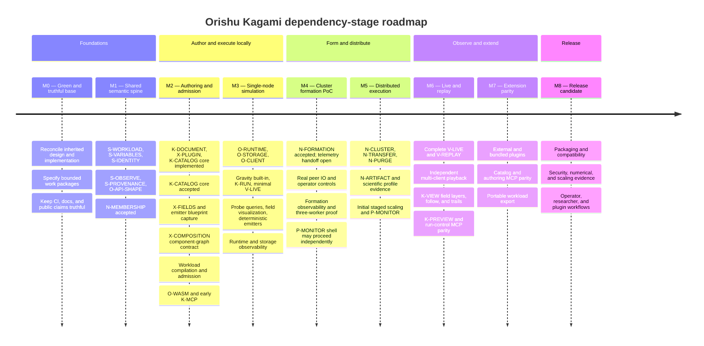

# Roadmap status report

Artifact type: **report — derived, non-authoritative**

Snapshot date: **2026-09-07**

This file is a compact view of the authoritative
[implementation roadmap](README.md) and [tracked tasks](../tasks/README.md).
It shows delivery stages without assigning calendar dates and makes current
completion state easy to scan. The linked roadmap, ADRs, and task files remain
authoritative when this report disagrees with them.

Update this report whenever a work package changes state or the authoritative
roadmap changes stage placement. A package is complete here only after its
task's acceptance evidence has been reviewed; documentation or code volume
alone is not completion evidence.

## Delivery timeline

The stages describe outcome order. They are not calendar periods and do not
prevent independent work from later-numbered stages when its dependencies are
satisfied. In particular, M4 cluster formation may proceed before M3 compute.

## Stage completion registry

Stage state is conservative: a stage is accepted only when every exit criterion
in the authoritative roadmap has evidence. Work in several stages can be active
at once.

| Stage | State | Completion evidence | Next material gate |
| --- | --- | --- | --- |
| M0 — Green and truthful foundation | In progress; not formally accepted | Documentation checks pass and the restored roadmap is tracked | Close remaining baseline/API decisions and verify every selected slice has a bounded task |
| M1 — Shared semantic spine | In progress | N-MEMBERSHIP and its shared membership identity prerequisite are accepted; the shared variable engine, dimension layer, and experiment integration have landed | Complete workload, shared variable-engine bounds/workload integration, observation, provenance, API-shape, and remaining identity contracts |
| M2 — Authoring and admission | In progress | K1, K3, their boundary follow-up, K4 experiment persistence, K2's core document graph, K5 catalog instantiation, K6 non-gesture app adoption, the core user stories, and the `kagami-catalog` core have landed | Complete the gated K2/K4–K6 slices, plugin/composition contracts, workload admission, default view/viewport integration, and Wasm host |
| M3 — Single-node simulation | Not started as a milestone | Prototype worker/client/Kagami surfaces exist but do not prove the outcome | Stable M1/M2 contracts, then a real admitted single-worker run |
| M4 — Operational cluster formation PoC | In progress | N-MEMBERSHIP and source-built Linux N-FORMATION are accepted, including worker/operator and multi-process evidence | Complete the companion observability and operator-documentation handoff required for combined M4 acceptance |
| M5 — Distributed execution | Planned; specification gates remain | Accepted formation, purge, and transfer constraints exist | N-FORMATION, single-node runtime, storage, workload, and scientific-profile fixtures |
| M6 — Multi-client observation | Planned; some tasks ready | Live-streaming and replay tasks are specified | Shared observation types, runtime/storage/client service, and K-RUN |
| M7 — Extension and authoring parity | Planned; specification gates remain | Catalog and MCP tasks are specified in part | Stable plugin, document, workload, run, and sandbox contracts |
| M8 — Installable release candidate | Planned | Release and packaging scaffolding exists | Feature/schema freeze plus all product, security, compatibility, observability, and scaling gates |

## Work-package completion registry

States mirror the authoritative roadmap as of the snapshot date:

- **Accepted** — implementation and acceptance evidence were reviewed.
- **Partial** — a useful implementation slice exists, but the package is not
  accepted.
- **Ready** — a bounded task can be assigned once its named dependencies hold.
- **Planned** — work is known but still needs a task specification.
- **Decision gate** — a design decision and task specification are required.

| Work package | Primary stage | State | Next step or gate |
| --- | --- | --- | --- |
| S-RESOURCE | M1–M2 | **Implemented and accepted** | `crates/orishu-resource` owns the envelope and both consumers use it with compatible fixtures; independent verification confirmed allocation-before-bound construction is fixed and the documented `NoStatus` policy matrix is covered |
| S-WORKLOAD | M1–M2 | Partial | Slices 1–2 and the structural portion of slice 3 are implemented and accepted — shared identity, canonical codec with golden fixtures, streaming closure validator, and collection bounds applied during authoring deserialization; implement slice 3's scientific policy, Kagami compilation, and the Orishu admission and distribution slices |
| S-VARIABLES | M1–M2 | Partial | Dimensioned evaluation, the declared shared-engine resource bounds (caller-supplied limits on source bytes, parse depth, node count, variable count, dependency depth, and evaluation work, with structured refusals and no partial mutation), and K2 experiment integration have landed; implement S-WORKLOAD integration |
| S-IDENTITY | M1 | Partial | Complete cluster projection and run identity contracts |
| S-OBSERVE | M1 | Ready | Implement shared run and observation frame types |
| S-PROVENANCE | M1 | Planned | Write the bounded task after identity, workload, observation, and plugin identities stabilize |
| K-DOCUMENT | M1–M2 | Partial | K1, K3, the boundary follow-up, and K4 experiment persistence are implemented; K2's core graph, K5 instantiation, and K6 non-gesture app adoption have landed, with remaining slices gated on X-PLUGIN/K5 symbol sources and K11 view/gesture work |
| X-PLUGIN | M1–M2 | Planned | Specify manifest, declarative schema, inventory, and management contracts |
| X-COMPOSITION | M2–M3 | Ready after gates | Host-orchestrated component graph accepted; define shared graph/phase/channel types and implement the multi-component host |
| X-FIELDS | M2–M3 | Ready after gates | Define field families, mutually exclusive model selection, stable couplings, workload state and observation projections |
| X-BUILTINS | M3–M7 | Planned | Implement gravity and electrodynamics through the public plugin/Wasm path |
| X-DIST-PROFILE | M1–M5 | Decision gate | Define candidate schema and evidence task; accept or replace ADR 0016 only after M5 evidence |
| K-CATALOG | M2–M7 | Core implemented and accepted | `kagami-catalog` carries the format, bounded loader, shared-dimension variable projection, guarded writes, catalog authority, shipped examples, and self-contained materialization. K5 document instantiation has landed. Later: live catalog/plugin symbol sources, workload capture, UI, and MCP |
| K-MCP | M2–M7 | Ready; later slices gated | Implement transport/status first; core document-authority adapters can follow now, while full authoring parity remains capability-gated and run parity waits on run authorities |
| K-OBSERVATION | M2–M6 | Ready after gates | Compile K8 instruments into workload requests and expose their retained readings through UI and bounded MCP queries |
| K-VIEW | M2–M6 | Ready after gates | Add saved authoring view/modes, essential field vectors/flow lines in M3, then richer replay plus live-gap/exact-trajectory trails |
| X-EMITTER | M2–M5 | Ready after gates | Capture catalog spawn blueprints, implement deterministic single-node spawning, then prove fenced distributed ownership |
| O-WASM | M2 | Ready after shared graph/ABI | Implement the capability-limited multi-component host and deterministic phase coordinator |
| O-RUNTIME | M3 | Planned | Specify the single-node component-plan authority and atomic commit loop |
| O-STORAGE | M3 | Planned | Specify local content-addressed inputs and committed result/checkpoint storage |
| O-API-SHAPE | M1 | Partial decision; broader gate remains | `metadata.uid` is canonical and implemented through `ResourceUid`, with node `NodeId` projection and wire fixtures; resolve the remaining resource compaction findings and version the initial client surface |
| O-CLIENT | M3 | Planned | Specify after API shape, runtime, storage, and observation contracts |
| K-RUN | M3 | Planned | Specify Kagami submission, run projection, and renderer handoff |
| K-PREVIEW | M6 | Planned | Specify local execution through the same Wasm and observation contracts |
| V-LIVE | M3–M6 | Ready after shared types | Implement minimal snapshots in M3, then resume/delta/multi-client behavior in M6 |
| V-REPLAY | M6 | Ready after stored observations | Implement exact time-addressable persisted playback |
| N-MEMBERSHIP | M1–M2 | **Accepted** | Feed the accepted sans-IO core into N-FORMATION |
| N-FORMATION | M4 | **Accepted for source-built Linux** | Preserve accepted formation evidence; finish P-OBSERVABILITY/P-OBS-DOCS for combined M4 |
| N-CLUSTER | M5 | Planned | Specify component-partition placement, reliable cross-component channels and distributed commit after formation and single-node semantics are proven |
| N-TRANSFER | M5 | Planned | Specify bounded verified QUIC artifact transfer |
| N-PURGE | M5 | Planned | Specify persisted tombstones and inventory suppression |
| N-ARTIFACT | M5 | Planned | Specify availability, replication, repair, and discovery after storage/transfer/purge |
| P-SCALE | M5–M8 | Planned | Specify and grow the staged 1/3/5/12/32-worker evidence harness |
| P-INSTALL | M8 | In progress | Candidate archives, Debian builds, Cargo-path install tests, staged checksums/provenance, and Homebrew handoff exist; next define crates.io graph, lifecycle tests, SBOM/signing, and supported M8 publication |
| P-OBSERVABILITY | M0–M8 | Ready by owning slice | Implement worker/formation instrumentation first, then extend with each service |
| P-OBS-DOCS | M4–M8 | Planned | Ship tested operator guidance alongside each observability slice |
| P-MONITOR | M4–M8 | Shell implemented; live integration backlog | The API-independent shell is implemented; next grow live views and safe actions to CLI parity as their owning contracts land, excluding raw admission-secret output |

## Immediate assignment

The active Orishu networking package is
[N-FORMATION](../tasks/implement-cluster-formation-poc.md). Its accepted input is
[N-MEMBERSHIP](../tasks/implement-membership-model.md), including the completed
[liveness-gossip merge correction](../tasks/fix-membership-liveness-gossip-merge.md).
It proceeds independently of workload execution, storage, Kagami, and the
physics-plugin lanes, subject to the remaining preflight and integration work
bounded by its task.
