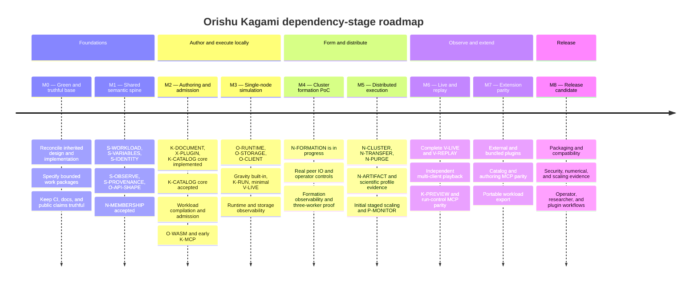

# Roadmap status report

Artifact type: **report — derived, non-authoritative**

Snapshot date: **2026-09-05**

This file is a compact view of the authoritative
[implementation roadmap](README.md) and [tracked tasks](../tasks/README.md).
It shows delivery stages without assigning calendar dates and makes current
completion state easy to scan. The linked roadmap, ADRs, and task files remain
authoritative when this report disagrees with them.

Update this report whenever a work package changes state or the authoritative
roadmap changes stage placement. A package is complete here only after its
task's acceptance evidence has been reviewed; documentation or code volume
alone is not completion evidence.

## Delivery timeline

The stages describe outcome order. They are not calendar periods and do not
prevent independent work from later-numbered stages when its dependencies are
satisfied. In particular, M4 cluster formation may proceed before M3 compute.

## Stage completion registry

Stage state is conservative: a stage is accepted only when every exit criterion
in the authoritative roadmap has evidence. Work in several stages can be active
at once.

| Stage | State | Completion evidence | Next material gate |
| --- | --- | --- | --- |
| M0 — Green and truthful foundation | In progress; not formally accepted | Documentation checks pass and the restored roadmap is tracked | Close remaining baseline/API decisions and verify every selected slice has a bounded task |
| M1 — Shared semantic spine | In progress | N-MEMBERSHIP and its shared membership identity prerequisite are accepted | Complete workload, quantity/variable, observation, provenance, API-shape, and remaining identity contracts |
| M2 — Authoring and admission | In progress | Generic variable engine and the `kagami-catalog` crate, authority, variable projection, shipped examples, and materialization core exist and are accepted; N-MEMBERSHIP is accepted | Implement the document authority, dimensional integration, workload admission, plugin inventory, and Wasm host |
| M3 — Single-node simulation | Not started as a milestone | Prototype worker/client/Kagami surfaces exist but do not prove the outcome | Stable M1/M2 contracts, then a real admitted single-worker run |
| M4 — Operational cluster formation PoC | In progress | N-MEMBERSHIP is accepted; replicated lock and codec/TLS adapter tests have landed | Complete remaining preflight, worker integration, operator surface, observability, and three-process proof |
| M5 — Distributed execution | Planned; specification gates remain | Accepted formation, purge, and transfer constraints exist | N-FORMATION, single-node runtime, storage, workload, and scientific-profile fixtures |
| M6 — Multi-client observation | Planned; some tasks ready | Live-streaming and replay tasks are specified | Shared observation types, runtime/storage/client service, and K-RUN |
| M7 — Extension and authoring parity | Planned; specification gates remain | Catalog and MCP tasks are specified in part | Stable plugin, document, workload, run, and sandbox contracts |
| M8 — Installable release candidate | Planned | Release and packaging scaffolding exists | Feature/schema freeze plus all product, security, compatibility, observability, and scaling gates |

## Work-package completion registry

States mirror the authoritative roadmap as of the snapshot date:

- **Accepted** — implementation and acceptance evidence were reviewed.
- **Partial** — a useful implementation slice exists, but the package is not
  accepted.
- **Ready** — a bounded task can be assigned once its named dependencies hold.
- **Planned** — work is known but still needs a task specification.
- **Decision gate** — a design decision and task specification are required.

| Work package | Primary stage | State | Next step or gate |
| --- | --- | --- | --- |
| S-RESOURCE | M1–M2 | Ready | Extract the generic typed resource envelope; migrate Orishu first, then adopt in Kagami (the catalog containment correction it waited on is accepted) |
| S-WORKLOAD | M1–M2 | Ready | Implement shared identity, closure, codec, compilation, and admission slices |
| S-VARIABLES | M1–M2 | Partial | Verify core bounds; add dimensions, document integration, and workload integration |
| S-IDENTITY | M1 | Partial | Complete cluster projection and run identity contracts |
| S-OBSERVE | M1 | Ready | Implement shared run and observation frame types |
| S-PROVENANCE | M1 | Planned | Write the bounded task after identity, workload, observation, and plugin identities stabilize |
| K-DOCUMENT | M1–M2 | Planned | Specify and implement the authoritative experiment model and persistence |
| X-PLUGIN | M1–M2 | Planned | Specify manifest, declarative schema, inventory, and management contracts |
| X-BUILTINS | M3–M7 | Planned | Implement gravity and electrodynamics through the public plugin/Wasm path |
| X-DIST-PROFILE | M1–M5 | Decision gate | Define candidate schema and evidence task; accept or replace ADR 0016 only after M5 evidence |
| K-CATALOG | M2–M7 | Core implemented and accepted | `kagami-catalog` carries the format, bounded loader, variable projection, guarded writes, catalog authority, shipped examples, and self-contained materialization. Identity collisions, rename events, symlinked ancestors and targets, missing descendants below a symlink, and temporary paths are all refused before any effect outside the catalog root. Later: shared dimension inference, document instantiation, workload capture, UI, and MCP |
| K-MCP | M2–M7 | Ready; later slices gated | Implement transport/status first; add authoring and run parity after their authorities exist |
| O-WASM | M2 | Planned | Specify and implement the capability-limited component host |
| O-RUNTIME | M3 | Planned | Specify the single-node fixed-step run authority and commit loop |
| O-STORAGE | M3 | Planned | Specify local content-addressed inputs and committed result/checkpoint storage |
| O-API-SHAPE | M1 | Decision gate | Resolve resource compaction and version the initial client surface |
| O-CLIENT | M3 | Planned | Specify after API shape, runtime, storage, and observation contracts |
| K-RUN | M3 | Planned | Specify Kagami submission, run projection, and renderer handoff |
| K-PREVIEW | M6 | Planned | Specify local execution through the same Wasm and observation contracts |
| V-LIVE | M3–M6 | Ready after shared types | Implement minimal snapshots in M3, then resume/delta/multi-client behavior in M6 |
| V-REPLAY | M6 | Ready after stored observations | Implement exact time-addressable persisted playback |
| N-MEMBERSHIP | M1–M2 | **Accepted** | Feed the accepted sans-IO core into N-FORMATION |
| N-FORMATION | M4 | **In progress** | Complete remaining preflight, worker integration, operator surface, observability, and real three-process proof |
| N-CLUSTER | M5 | Planned | Specify after formation and single-node runtime semantics are proven |
| N-TRANSFER | M5 | Planned | Specify bounded verified QUIC artifact transfer |
| N-PURGE | M5 | Planned | Specify persisted tombstones and inventory suppression |
| N-ARTIFACT | M5 | Planned | Specify availability, replication, repair, and discovery after storage/transfer/purge |
| P-SCALE | M5–M8 | Planned | Specify and grow the staged 1/3/5/12/32-worker evidence harness |
| P-INSTALL | M8 | Ready for early slices | Implement the linked artifact-publication task and installation matrix; publication waits for M8 product readiness |
| P-OBSERVABILITY | M0–M8 | Ready by owning slice | Implement worker/formation instrumentation first, then extend with each service |
| P-OBS-DOCS | M4–M8 | Planned | Ship tested operator guidance alongside each observability slice |
| P-MONITOR | M5–M8 | Planned | Specify after real membership and operational projection models stabilize |

## Immediate assignment

The active Orishu networking package is
[N-FORMATION](../tasks/implement-cluster-formation-poc.md). Its accepted input is
[N-MEMBERSHIP](../tasks/implement-membership-model.md), including the completed
[liveness-gossip merge correction](../tasks/fix-membership-liveness-gossip-merge.md).
It proceeds independently of workload execution, storage, Kagami, and the
physics-plugin lanes, subject to the remaining preflight and integration work
bounded by its task.
